```mermaid
sequenceDiagram
    participant FE as Frontend
    participant API as POST /api/playbook
    participant SB as Supabase
    participant SN as Claude Sonnet

    FE->>API: { speaker, topic }
    API->>SB: auth.getUser()
    SB-->>API: user ✓

    par 4 Parallel Lenses
        API->>SB: Beliefs query (speaker + topic)
        API->>SB: Timeline query (temporal agg)
        API->>SB: Sentiment query (polarity dist)
        API->>SB: Context query (similarity + related)
        SB-->>API: beliefs result
        SB-->>API: timeline result
        SB-->>API: sentiment result
        SB-->>API: context result
    end

    Note over API: Promise.allSettled → lenses + failures

    API-->>FE: SSE: { type: "lenses", lenses, failures }

    API->>SN: streamText(synthesisPrompt + lensContext)
    loop Streaming Tokens
        SN-->>API: token
        API-->>FE: SSE: { type: "synthesis", text: token }
    end

    API-->>FE: SSE: { type: "done" }
```

# Agent Blueprint — Bitcoinology v2

**Status:** Engineering Review Draft  
**Date:** 2026-02-12  
**Based on:** v1 codebase + architecture docs

---

## Table of Contents

1. [Shared Infrastructure](#shared-infrastructure)
2. [Oracle Agent](#1-oracle-agent)
3. [Jackal Agent](#2-jackal-agent)
4. [Playbook Agent](#3-playbook-agent)
5. [Agent Coordination](#agent-coordination)

---

## Shared Infrastructure

### Common MCPs

| Service | Purpose | Current Status |
|:--------|:--------|:---------------|
| **Qdrant Cloud** | Vector similarity search (1536-dim, cosine) | ✅ Implemented — used in direct search tools |
| **Supabase** | Auth (user sessions), metadata (threads, speaker aggregations, similarity), storage | ✅ Implemented — auth in all routes, graph data, threads |
| **Claude/Anthropic** | LLM reasoning — Haiku (fast/rerank), Sonnet (synthesis), Opus (strategic) | ✅ Partial — Haiku for direct search, Sonnet for playbook synthesis |
| **OpenAI** | Embeddings (`text-embedding-3-large`, 1536-dim) | ✅ Implemented — query embedding for vector search |
| **Motia** | Flow orchestration, event routing, step management | ❌ Not yet implemented — v1 uses Next.js API routes directly |
| **Redis** | State persistence, caching, rate limiting | ❌ Not yet implemented — v1 uses in-memory cache only |

### Auth Flow

```
Request → Supabase auth.getUser() → 401 if no user → proceed
```

**Current:** Every API route calls `createClient()` + `getUser()` independently. No middleware.  
**v2 Target:** Middleware-based auth + rate limiting via Redis.

### Rate Limiting

**Current:** None.  
**v2 Target:**

| Tier | Requests/min | Burst |
|:-----|:-------------|:------|
| Free | 10 | 20 |
| Beta | 30 | 60 |
| Speaker | 60 | 120 |

Implementation: Redis sliding window per `user.id`.

### Caching Strategy

| Layer | What | TTL | Current Status |
|:------|:-----|:----|:---------------|
| In-memory | Graph data (nodes/links) | 1 hour | ✅ Implemented (`graph/data/route.ts`) |
| Redis | Query results by hash | 15 min | ❌ Needs build |
| Redis | Embedding vectors | 24 hours | ❌ Needs build |
| CDN | Parquet files | Until invalidation | ✅ Via HuggingFace |

---

## 1. Oracle Agent

### Agent Name & Role

**Oracle** — Multi-perspective reasoning engine for complex Bitcoin questions requiring deep analysis across multiple belief dimensions.

### Trigger Conditions

| Trigger | Source | Current Status |
|:--------|:-------|:---------------|
| Query requires cross-speaker reasoning | Query router determines BE data alone isn't enough, no external data needed | ❌ Router not built |
| Query involves philosophical/strategic analysis | Classifier detects complex intent | ❌ Classifier exists but doesn't route to Oracle |
| User explicitly requests deep analysis | UI "Deep Analysis" button | ❌ UI not built |

**v1 Reality:** Oracle does not exist in v1. Direct search (`directSearch()`) handles everything via Haiku + tool calling.

### Workflow Steps

```
Step 1: Query Receipt & Classification
  Input:  { query: string, context?: { speaker?, topic? }, sessionId: string }
  Output: { intent, entities[], complexity: "simple" | "complex" | "strategic" }
  MCP:    Claude Haiku (intent classification)

Step 2: Parallel Perspective Generation
  Input:  Classified query + entities
  Output: 3 perspective drafts (quick, deep, strategic)
  MCP:    Claude Haiku (quick take) | Claude Sonnet (deep) | Claude Opus (strategic)
         Qdrant (belief retrieval for each perspective)
         OpenAI (query embedding)

Step 3: Cross-Reference & Contradiction Detection  
  Input:  3 perspective drafts + retrieved beliefs
  Output: { agreements[], contradictions[], novel_connections[] }
  MCP:    Claude Sonnet (cross-reference analysis)

Step 4: Synthesis
  Input:  Perspectives + cross-references + source beliefs
  Output: Unified narrative with citations
  MCP:    Claude Opus (final synthesis)

Step 5: Response Streaming
  Input:  Synthesized response
  Output: SSE stream to client
  MCP:    None (pure I/O)
```

### MCPs Per Step

| Step | Qdrant | Supabase | Claude | OpenAI | Motia | Redis |
|:-----|:-------|:---------|:-------|:-------|:------|:------|
| 1. Classify | — | Auth | Haiku | — | Event trigger | Cache check |
| 2. Perspectives | top-k=20 per perspective | Speaker metadata | Haiku+Sonnet+Opus (parallel) | Embed query | — | — |
| 3. Cross-ref | — | — | Sonnet | — | — | — |
| 4. Synthesize | — | — | Opus | — | — | Cache write |
| 5. Stream | — | Save thread msg | — | — | Event emit | — |

### Skills

- **Query decomposition** — Break complex questions into analyzable sub-questions
- **Multi-model orchestration** — Run Haiku/Sonnet/Opus in parallel, reconcile outputs
- **Contradiction detection** — Find where speakers/beliefs disagree
- **Belief ranking** — Score beliefs by relevance, confidence, and recency
- **Narrative synthesis** — Weave multiple perspectives into coherent analysis
- **Citation linking** — Map every claim to source belief → episode → timestamp

### Context Window

```
System Prompt (~500 tokens):
  - Role definition (multi-perspective analyst)
  - Output format constraints
  - Citation requirements
  - Hedging rules (don't editorialize)

Retrieved Beliefs (~2000-4000 tokens):
  - Top-k beliefs from Qdrant per perspective
  - Fields: atomic_belief, quote_text, speaker_name, polarity, episode_slug, timestamp_start

Speaker Profiles (~200 tokens per speaker):
  - Name, known positions, episode count
  - From Supabase speaker aggregations

Perspective Outputs (~1500 tokens):
  - Quick take (Haiku output)
  - Deep analysis (Sonnet output)  
  - Strategic view (Opus output)

Cross-Reference Results (~500 tokens):
  - Agreements, contradictions, novel connections
```

### Input/Output Schema

```typescript
// Input
interface OracleInput {
  query: string;
  sessionId: string;
  context?: {
    speaker?: string;    // speaker slug
    topic?: string;      // topic filter
    threadId?: string;   // conversation continuity
  };
}

// Output (streamed via SSE)
interface OracleOutput {
  perspectives: {
    quick: { summary: string; beliefs: BeliefRef[] };
    deep: { analysis: string; beliefs: BeliefRef[] };
    strategic: { insight: string; beliefs: BeliefRef[] };
  };
  crossReferences: {
    agreements: { speakers: string[]; claim: string }[];
    contradictions: { speakerA: string; speakerB: string; claim: string; counterClaim: string }[];
  };
  synthesis: string;           // Final narrative (streamed)
  citations: Citation[];
  meta: { latencyMs: number; tokensUsed: number; modelsUsed: string[] };
}
```

### SSE Event Stream

```jsonc
// Step 1
{"type": "step_start", "step": "classify", "label": "🧠 Understanding your question"}
{"type": "step_complete", "step": "classify", "data": {"intent": "compare", "complexity": "complex"}}

// Step 2 (parallel)
{"type": "step_start", "step": "perspectives", "label": "🔮 Generating perspectives"}
{"type": "step_progress", "step": "perspectives", "data": {"quick": "complete"}}
{"type": "step_progress", "step": "perspectives", "data": {"deep": "complete"}}
{"type": "step_progress", "step": "perspectives", "data": {"strategic": "complete"}}
{"type": "step_complete", "step": "perspectives"}

// Step 3
{"type": "step_start", "step": "cross_ref", "label": "🔗 Cross-referencing beliefs"}
{"type": "step_complete", "step": "cross_ref", "data": {"agreements": 3, "contradictions": 2}}

// Step 4
{"type": "step_start", "step": "synthesis", "label": "📝 Synthesizing analysis"}
{"type": "stream_token", "step": "synthesis", "token": "Michael "}
{"type": "stream_token", "step": "synthesis", "token": "Saylor's "}
// ... streaming tokens

// Step 5
{"type": "done", "meta": {"latencyMs": 8200, "tokensUsed": 12400}}
```

### Error Handling

| Failure | Recovery | User Impact |
|:--------|:---------|:------------|
| Haiku quick take fails | Skip, proceed with Sonnet + Opus | Minimal — 2 perspectives instead of 3 |
| Opus strategic fails | Sonnet handles synthesis | Slightly less nuanced output |
| Qdrant timeout | Fallback to embeddings.parquet | +5s latency |
| All perspectives fail | Downgrade to direct search | Falls back to v1 behavior |
| Synthesis timeout (>60s) | Return raw perspectives without synthesis | Partial but usable result |

### Performance Targets

| Step | Target | Budget |
|:-----|:-------|:-------|
| Classify | <300ms | Haiku call |
| Embed query | <200ms | OpenAI API |
| Vector search | <400ms | Qdrant |
| Quick take (Haiku) | <1s | Parallel |
| Deep analysis (Sonnet) | <3s | Parallel |
| Strategic view (Opus) | <5s | Parallel — bottleneck |
| Cross-reference | <2s | Sonnet |
| Synthesis | <4s (streaming start) | Opus |
| **Total (first token)** | **<8s** | |
| **Total (complete)** | **<15s** | |

### Mermaid Sequence Diagram


---

## 2. Jackal Agent

### Agent Name & Role

**Jackal** — Web-enriched research agent that blends real-time external data with internal belief graph for current-events context.

### Trigger Conditions

| Trigger | Source | Current Status |
|:--------|:-------|:---------------|
| Query references current events | Classifier detects temporal signals ("latest", "recent", dates) | ❌ Not built |
| Query about entities not in belief graph | Entity lookup returns empty | ❌ Not built |
| Oracle finds thin internal coverage | <3 relevant beliefs returned | ❌ Not built |
| User clicks "Enrich with Web" | Explicit UI trigger | ❌ Not built |

**v1 Reality:** Jackal does not exist. No web search capability.

### Workflow Steps

```
Step 1: Query Analysis & Decomposition
  Input:  { query, internalContext?: beliefs[] }
  Output: { subQueries: string[], searchStrategy: "news" | "academic" | "social" }
  MCP:    Claude Haiku

Step 2: Parallel Web Search
  Input:  subQueries[]
  Output: { webResults: WebSnippet[] } per sub-query
  MCP:    Tavily API (web search), 1 call per sub-query

Step 3: Source Validation & Filtering
  Input:  webResults[]
  Output: { validatedResults: WebSnippet[], rejected: { url, reason }[] }
  MCP:    Claude Haiku (relevance + credibility scoring)

Step 4: Internal Belief Retrieval
  Input:  Original query + sub-queries
  Output: { beliefs: Belief[] }
  MCP:    OpenAI (embedding), Qdrant (vector search)

Step 5: Context Merging
  Input:  validatedResults[] + beliefs[]
  Output: Merged narrative blending web + internal data
  MCP:    Claude Sonnet (synthesis with source attribution)

Step 6: Response Streaming
  Input:  Merged narrative
  Output: SSE stream
  MCP:    None
```

### MCPs Per Step

| Step | Qdrant | Supabase | Claude | OpenAI | Tavily | Redis |
|:-----|:-------|:---------|:-------|:-------|:-------|:------|
| 1. Decompose | — | Auth | Haiku | — | — | Cache check |
| 2. Web Search | — | — | — | — | 1-3 calls | — |
| 3. Validate | — | — | Haiku | — | — | — |
| 4. Internal | top-k=15 | — | — | Embed | — | — |
| 5. Merge | — | — | Sonnet | — | — | Cache write |
| 6. Stream | — | Save msg | — | — | — | — |

### Skills

- **Query decomposition** — Split compound questions into focused sub-queries
- **Web search orchestration** — Parallel Tavily calls with dedup
- **Source credibility scoring** — Filter noise, rank by reliability
- **Context blending** — Merge external data with internal beliefs without hallucination
- **Temporal awareness** — Distinguish between historical beliefs and current events
- **Attribution discipline** — Always distinguish "Saylor said X" (internal) from "Reuters reported Y" (web)

### Context Window

```
System Prompt (~400 tokens):
  - Role: Web-enriched research agent
  - Rules: Always distinguish internal vs external sources
  - Output format

Web Results (~2000 tokens):
  - Validated snippets with source URLs
  - Publication dates

Internal Beliefs (~1500 tokens):
  - Relevant beliefs from Qdrant
  - Speaker, polarity, quote, timestamp

Merge Instructions (~200 tokens):
  - How to weight internal vs external
  - Citation format requirements
```

### Input/Output Schema

```typescript
// Input
interface JackalInput {
  query: string;
  sessionId: string;
  internalContext?: {
    beliefs: BeliefRef[];     // Pre-fetched by Oracle handoff
    coverage: "thin" | "none";
  };
}

// Output
interface JackalOutput {
  webSources: {
    title: string;
    url: string;
    snippet: string;
    publishedDate?: string;
    credibilityScore: number;  // 0-1
  }[];
  internalBeliefs: BeliefRef[];
  synthesis: string;           // Streamed narrative
  citations: (Citation | WebCitation)[];
  meta: { latencyMs: number; webQueriesCount: number; tokensUsed: number };
}
```

### SSE Event Stream

```jsonc
{"type": "step_start", "step": "decompose", "label": "🧠 Breaking down your question"}
{"type": "step_complete", "step": "decompose", "data": {"subQueries": 3}}

{"type": "step_start", "step": "web_search", "label": "🌐 Searching the web"}
{"type": "step_progress", "step": "web_search", "data": {"thread": 1, "results": 8}}
{"type": "step_progress", "step": "web_search", "data": {"thread": 2, "results": 5}}
{"type": "step_complete", "step": "web_search", "data": {"totalResults": 18}}

{"type": "step_start", "step": "validate", "label": "✅ Validating sources"}
{"type": "step_complete", "step": "validate", "data": {"kept": 12, "rejected": 6}}

{"type": "step_start", "step": "internal_search", "label": "🔍 Searching belief graph"}
{"type": "step_complete", "step": "internal_search", "data": {"beliefs": 9}}

{"type": "step_start", "step": "merge", "label": "📝 Merging insights"}
{"type": "stream_token", "step": "merge", "token": "Recent "}
// ... streaming

{"type": "done", "meta": {"latencyMs": 6500, "webQueries": 3}}
```

### Error Handling

| Failure | Recovery | User Impact |
|:--------|:---------|:------------|
| Tavily quota exhausted | Return internal-only results | No web context, noted in response |
| Tavily timeout (>10s) | Proceed with whatever returned | Partial web results |
| All web results invalid | Return internal beliefs only | Degrades to Oracle/direct search |
| Qdrant down | Web-only response | Missing internal belief context |
| Sonnet merge fails | Return raw validated web snippets + beliefs separately | Unmerged but still useful |

### Performance Targets

| Step | Target | Budget |
|:-----|:-------|:-------|
| Decompose | <500ms | Haiku |
| Web search (parallel) | <3s | Tavily (bottleneck) |
| Validate | <1s | Haiku |
| Internal search | <500ms | OpenAI embed + Qdrant |
| Merge & stream (first token) | <2s | Sonnet |
| **Total (first token)** | **<6s** | |
| **Total (complete)** | **<12s** | |

### Mermaid Sequence Diagram


---

## 3. Playbook Agent

### Agent Name & Role

**Playbook** — Parallel multi-lens analysis engine that examines speaker beliefs through structured dimensions (beliefs, timeline, sentiment, context).

### Trigger Conditions

| Trigger | Source | Current Status |
|:--------|:-------|:---------------|
| User selects speaker + topic in Playbook UI | `POST /api/playbook { speaker, topic }` | ✅ Implemented |
| Query router identifies playbook-shaped query | Classifier detects "what does X think about Y" pattern | ❌ Router not built (v1 is manual) |

**v1 Reality:** Fully implemented. `runPlaybook()` runs 4 parallel lenses via Supabase queries, then streams Sonnet synthesis.

### Workflow Steps

```
Step 1: Input Validation
  Input:  { speaker: string, topic: string }
  Output: Validated speaker slug + topic string
  MCP:    Supabase (auth)
  Status: ✅ Implemented

Step 2: Parallel Lens Execution (4 lenses)
  Input:  speaker + topic
  Output: { beliefs, timeline, sentiment, context } (each nullable)
  MCP:    Supabase (4 parallel queries — beliefs, episodes, sentiment, speaker similarity)
  Status: ✅ Implemented

  2a. Beliefs Lens
    Query: beliefs by speaker + topic → polarity, statements, quotes
    Output: { summary, beliefs[]: { statement, polarity, quote, episode } }

  2b. Timeline Lens
    Query: temporal aggregation of mentions
    Output: { summary, trend, mentions[]: { period, count } }

  2c. Sentiment Lens
    Query: polarity distribution
    Output: { dominantSentiment, nuance, evolution? }

  2d. Context Lens
    Query: speaker similarity + related topics
    Output: { networkPosition, similarSpeakers[], relatedTopics[] }

Step 3: Synthesis Context Assembly
  Input:  4 lens results (nullable) + failures[]
  Output: Formatted prompt string
  MCP:    None (pure string building)
  Status: ✅ Implemented (buildSynthesisContext)

Step 4: Streaming Synthesis
  Input:  Assembled context string
  Output: SSE stream of synthesis narrative
  MCP:    Claude Sonnet
  Status: ✅ Implemented

Step 5: Client Delivery
  Input:  Lens data + synthesis stream
  Output: SSE events: lenses (bulk) → synthesis tokens → done
  MCP:    None
  Status: ✅ Implemented
```

### MCPs Per Step

| Step | Qdrant | Supabase | Claude | OpenAI | Motia | Redis |
|:-----|:-------|:---------|:-------|:-------|:------|:------|
| 1. Validate | — | Auth | — | — | — | — |
| 2. Lenses (×4) | — | 4 parallel queries | — | — | — | — |
| 3. Assembly | — | — | — | — | — | — |
| 4. Synthesize | — | — | Sonnet | — | — | — |
| 5. Stream | — | — | — | — | — | — |

**Note:** v1 Playbook uses Supabase (not Qdrant) for lens queries. v2 could add Qdrant for semantic lens matching.

### Skills

- **Parallel lens orchestration** — Run 4 independent analyses concurrently with `Promise.allSettled`
- **Graceful degradation** — Continue with available lenses when some fail
- **Belief classification** — Categorize beliefs by polarity and confidence
- **Temporal analysis** — Track belief mention frequency over time
- **Speaker network mapping** — Find similar speakers by belief alignment
- **Synthesis with gaps** — Produce coherent narrative even with missing lenses

### Context Window

```
System Prompt (~200 tokens):
  - SYNTHESIS_PROMPT constant
  - Guidelines: lead with surprising finding, quantify, cite, 3-5 sentences

Lens Results (~800-1500 tokens):
  - Beliefs: summary + key beliefs with polarity
  - Timeline: summary + trend + mention count
  - Sentiment: dominant + nuance + evolution
  - Context: network position + similar speakers + related topics

Failure Notice (~50 tokens):
  - Which lenses failed and why
```

### Input/Output Schema

```typescript
// Input
interface PlaybookInput {
  speaker: string;   // speaker slug, e.g. "michael-saylor"
  topic: string;     // free text, e.g. "ETF approval"
}

// Output (SSE stream)
// Event 1: Bulk lens data
interface LensEvent {
  type: "lenses";
  lenses: {
    beliefs: BeliefsResult | null;
    timeline: TimelineResult | null;
    sentiment: SentimentResult | null;
    context: ContextResult | null;
  };
  failures: string[];
}

// Event 2..N: Synthesis tokens
interface SynthesisChunk {
  type: "synthesis";
  text: string;       // incremental token
}

// Final event
interface DoneEvent {
  type: "done";
}

// Error event
interface SynthesisError {
  type: "synthesis_error";
  error: string;
}
```

### SSE Event Stream

```jsonc
// Actual v1 implementation — this IS what gets sent:
data: {"type":"lenses","lenses":{"beliefs":{...},"timeline":{...},"sentiment":{...},"context":{...}},"failures":[]}

data: {"type":"synthesis","text":"Michael "}
data: {"type":"synthesis","text":"Saylor's "}
data: {"type":"synthesis","text":"stance "}
// ... streaming tokens

data: {"type":"done"}
```

**v2 Target — add workflow tree events before lens data:**

```jsonc
{"type": "step_start", "step": "lenses", "label": "📊 Running 4 analysis lenses"}
{"type": "step_progress", "step": "lenses", "data": {"beliefs": "complete", "timeline": "running"}}
{"type": "step_complete", "step": "lenses", "data": {"completed": 4, "failed": 0}}
{"type": "lenses", "lenses": {...}, "failures": []}
{"type": "step_start", "step": "synthesis", "label": "💬 Synthesizing insights"}
{"type": "synthesis", "text": "..."}
{"type": "done"}
```

### Error Handling

**Current v1 implementation (✅):**

| Failure | Recovery | Code |
|:--------|:---------|:-----|
| 1-2 lenses fail | Continue with available, note failures | `Promise.allSettled` + `failures[]` |
| 3+ lenses fail | Still attempts synthesis with whatever's available | Same mechanism |
| All lenses fail | Synthesis gets only failure notice | Degrades but doesn't crash |
| Synthesis stream fails | Emits `synthesis_error` event | `try/catch` in stream loop |
| Client disconnects | Stream iteration ends naturally | `cancel()` handler on ReadableStream |
| Abort signal | Passed to Sonnet + lens calls | `req.signal` propagated |

### Performance Targets

| Step | Target | Actual v1 (est.) |
|:-----|:-------|:-----------------|
| Auth check | <50ms | ~50ms |
| 4 parallel lenses | <800ms | ~500-800ms (Supabase queries) |
| Context assembly | <5ms | <5ms |
| Synthesis first token | <1.5s | ~1-1.5s (Sonnet) |
| Synthesis complete | <3s | ~2-3s |
| **Total (first lens data)** | **<1s** | **~800ms ✅** |
| **Total (synthesis complete)** | **<4s** | **~3-4s ✅** |

### Mermaid Sequence Diagram



---

## Agent Coordination

### Query Router (v2 — needs build)

The orchestrator determines which agent handles a query. In v1, all queries go to direct search. v2 introduces intelligent routing.

```mermaid
flowchart TD
    Q[User Query] --> AUTH{Authenticated?}
    AUTH -->|No| REJECT[401]
    AUTH -->|Yes| CACHE{Redis cache hit?}
    CACHE -->|Yes| CACHED[Return cached]
    CACHE -->|No| CLASSIFY[Classify Intent<br/>Claude Haiku]
    
    CLASSIFY --> IS_PB{Playbook pattern?<br/>"What does X think about Y"}
    IS_PB -->|Yes| PB[Playbook Agent]
    
    IS_PB -->|No| COMPLEXITY{Complex reasoning?}
    COMPLEXITY -->|Simple| DS[Direct Search<br/>existing v1]
    COMPLEXITY -->|Complex| ORACLE[Oracle Agent]
    
    ORACLE --> COVERAGE{Internal coverage?}
    COVERAGE -->|Thin| JACKAL[Jackal Agent<br/>web enrichment]
    COVERAGE -->|Sufficient| ORACLE_SYNTH[Oracle Synthesis]
```

### Oracle → Jackal Handoff

When Oracle finds thin internal coverage (<3 relevant beliefs), it can delegate to Jackal:

```typescript
// Pseudocode — needs build
interface HandoffPayload {
  originalQuery: string;
  oracleFindings: {
    beliefs: BeliefRef[];      // What Oracle already found
    coverage: "thin" | "none";
    gaps: string[];            // What's missing
  };
  sessionId: string;
}

// Oracle emits:
// SSE: {"type": "handoff", "from": "oracle", "to": "jackal", "reason": "thin coverage"}
// Jackal receives oracleFindings.beliefs so it doesn't re-search
```

### Playbook → Oracle Reference

When a Playbook result surfaces contradictions or surprising findings, the UI can offer "Go Deeper" which triggers Oracle with pre-loaded Playbook context:

```typescript
// Pseudocode — needs build
interface PlaybookToOracleInput {
  query: string;                    // Auto-generated from playbook finding
  playbookContext: {
    speaker: string;
    topic: string;
    lenses: PlaybookResult['lenses'];
    synthesisExcerpt: string;
  };
}
```

### Coordination Events (Motia v2)

| Event | Producer | Consumer | Payload |
|:------|:---------|:---------|:--------|
| `task.search` | Router | Direct Search | `{ query, sessionId }` |
| `task.playbook` | Router | Playbook | `{ speaker, topic, sessionId }` |
| `task.advise` | Router | Oracle | `{ query, context, sessionId }` |
| `task.enrich` | Router or Oracle | Jackal | `{ query, internalContext, sessionId }` |
| `oracle.handoff` | Oracle | Jackal | `{ query, beliefs, gaps }` |
| `*.complete` | Any agent | Response Stream | `{ sessionId, result }` |

---

## Implementation Status Summary

| Component | v1 Status | v2 Work Needed |
|:----------|:----------|:---------------|
| **Direct Search** | ✅ Working (Haiku + tools) | Minor — add SSE workflow events |
| **Playbook Agent** | ✅ Working (4 lenses + Sonnet) | Minor — add workflow tree events, Motia migration |
| **Oracle Agent** | ❌ Not built | Full build — multi-model orchestration, cross-ref |
| **Jackal Agent** | ❌ Not built | Full build — Tavily integration, source validation |
| **Query Router** | ❌ Not built | Full build — classifier + routing logic |
| **Motia Orchestration** | ❌ Not built | Full build — event system, step management |
| **Redis Caching** | ❌ Not built | Moderate — cache layer, rate limiting |
| **SSE Workflow Tree** | ❌ Not built (Playbook has basic SSE) | Moderate — unified event format across agents |
| **Graph API** | ✅ Working (speaker aggregations) | Minor — tie into agent results |
| **Thread Persistence** | ✅ Working (query route) | Minor — extend to all agents |
| **Auth** | ✅ Working (Supabase per-route) | Minor — centralize to middleware |

### Build Priority

1. **Query Router + Classifier** — unlocks agent selection
2. **Oracle Agent** — highest user value, complex queries
3. **Unified SSE format** — workflow tree across all agents
4. **Jackal Agent** — web enrichment
5. **Motia migration** — proper orchestration
6. **Redis layer** — caching + rate limiting
