# Bitcoinology Design Deck
### v0.2 — February 12, 2026

> All assets use consistent 16-bit pixel art style. One aesthetic, one vibe.

---

## Table of Contents

- [1. Search Experience Flow](#1-search-experience-flow)
- [2. Belief Cards](#2-belief-cards)
- [3. Community Cards](#3-community-cards)
- [4. Speaker Profiles](#4-speaker-profiles)
- [5. Speaker Tier System](#5-speaker-tier-system)
- [6. World Building](#6-world-building)
- [7. Entity Model](#7-entity-model)
- [8. Avatar Generation Pipeline](#8-avatar-generation-pipeline)

---

## 1. Search Experience Flow

### 1a. Search Loading — "The Training Run"
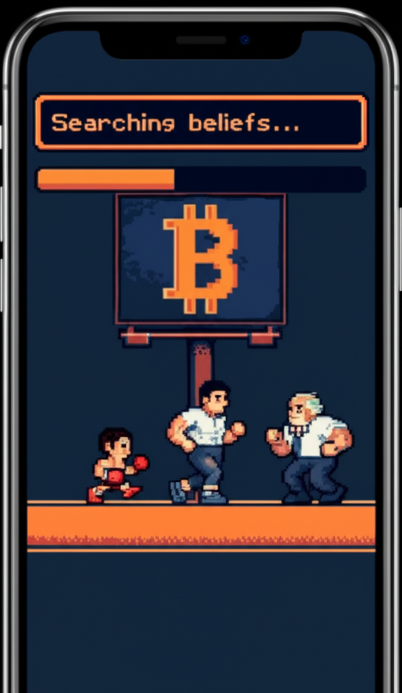

User hits search → retro 8-bit animated scene plays. Punch-Out training montage: pixel characters running on an orange track. "Searching beliefs..." in pixel search bar. Loops while agents work. Randomly rotates through different retro scenes.

### 1b. Search Complete — "The Strike"
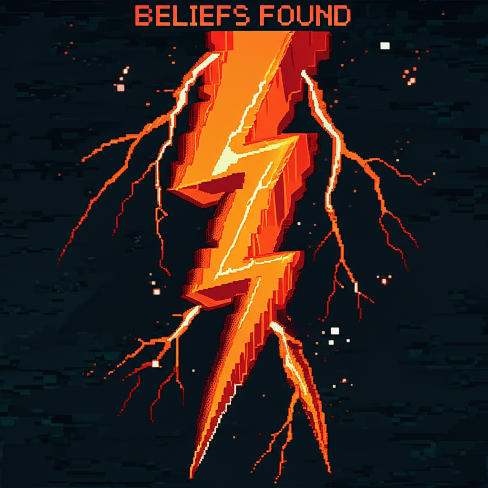

Search results ready → screen flashes → massive orange pixel lightning bolt cracks down. "BELIEFS FOUND" in arcade pixel font. The bolt branches at the bottom into workflow nodes. 500ms choreographed animation.

### 1c. Active Pipeline — "The Workflow Tree"
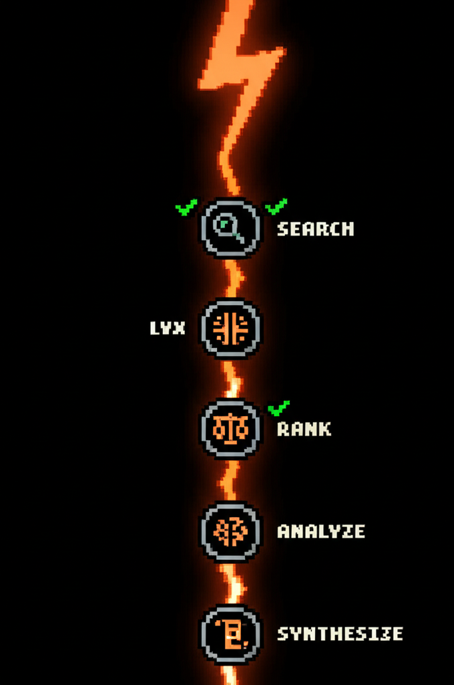

The bolt becomes a glowing pipeline. Each node = agent step: SEARCH → ANALYZE → RANK → SYNTHESIZE. Green pixel checkmarks light up as steps complete. Energy flows downward. For Jackal deep research, the bolt branches into parallel threads.

### 1d. Results — "The Loot"
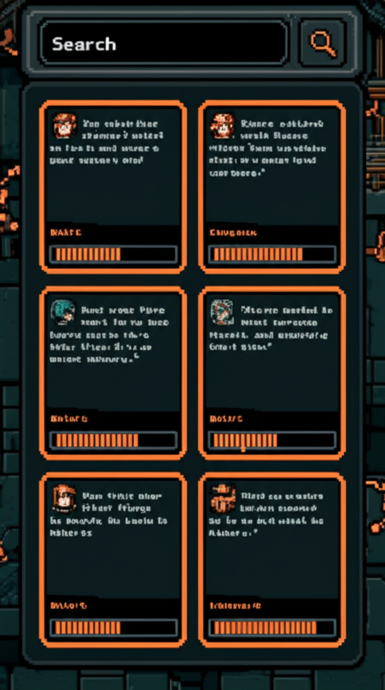

Belief cards land in a grid. Orange pixel borders, quotes, graph viz in corner. RPG inventory screen aesthetic. Tap any card to inspect deeper.

---

## 2. Belief Cards

### 2a. Card Face — The Collectible
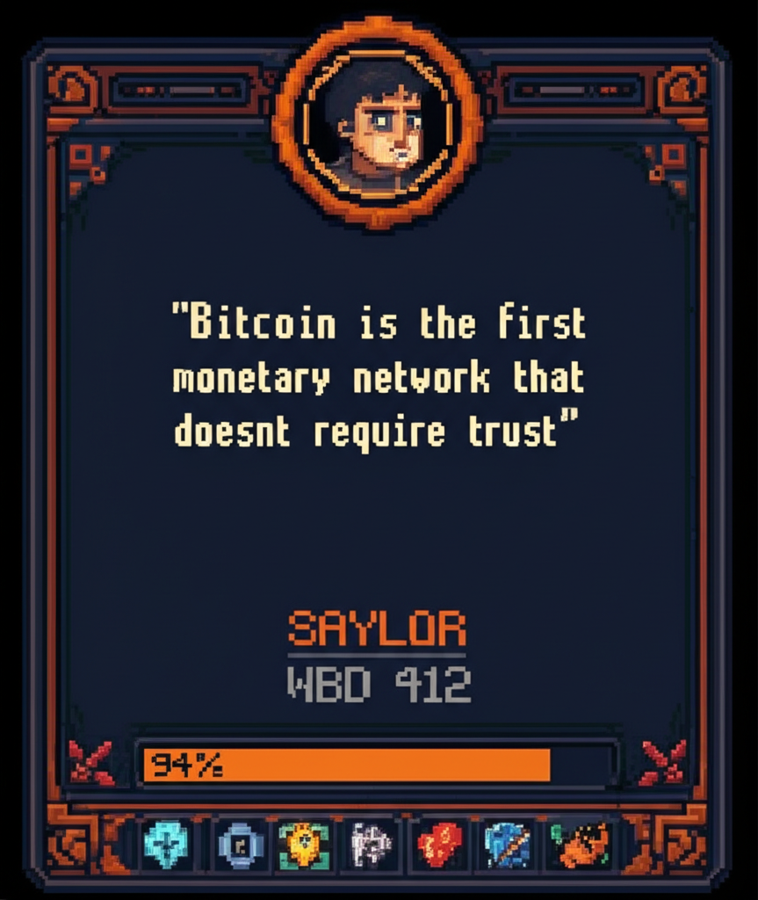

Pixel avatar, quote in pixel font, speaker name + episode, 94% confidence as pixel health bar. Bottom icons for Ontology, Connections, Source. Shareable, collectible.

### 2b. Card Expanded — The Portal
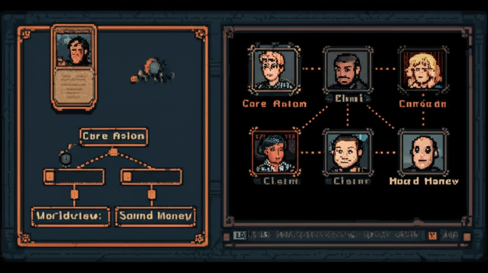

Tap to inspect. Ontology tree (Core Axiom → Worldview → Claim). Connected speakers with mini-cards linked by pixel connection lines. Every node tappable.

### 2c. Card Social Embed — The Growth Loop

How it looks shared on Twitter/X. @Bitcoinology branding, quote, ontology badge. Every shared card drives users to the app. Pixel art renders beautifully as social previews.

---

## 3. Community Cards

### 3a. User Belief Card (Teal Border)
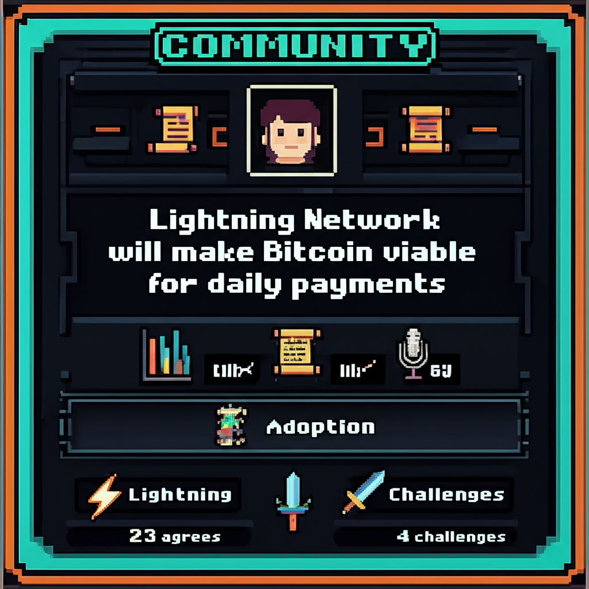

Different color (teal/cyan) for user-created beliefs. Pixel avatar, belief statement, research evidence as pixel items (scroll, microphone). Lightning votes: ⚡ agrees / ⚔️ challenges. CRAFTED by users, not MINED from podcasts.

---

## 4. Speaker Profiles

### 4a. RPG Character Sheet
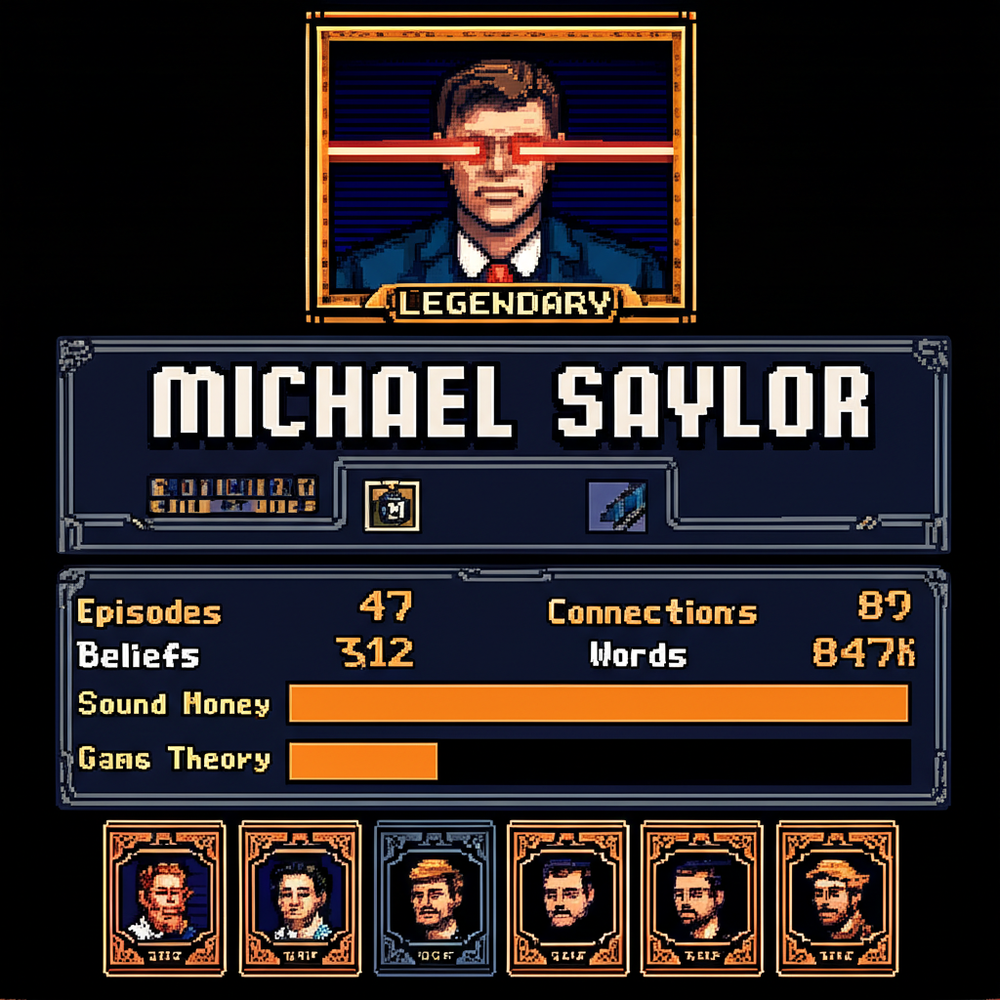

Full pixel RPG character sheet. Legendary portrait, stats (Episodes, Beliefs, Connections, Words), skill bars by topic. Mini belief card thumbnails. Character select screen aesthetic.

### 4b. Belief Network Graph
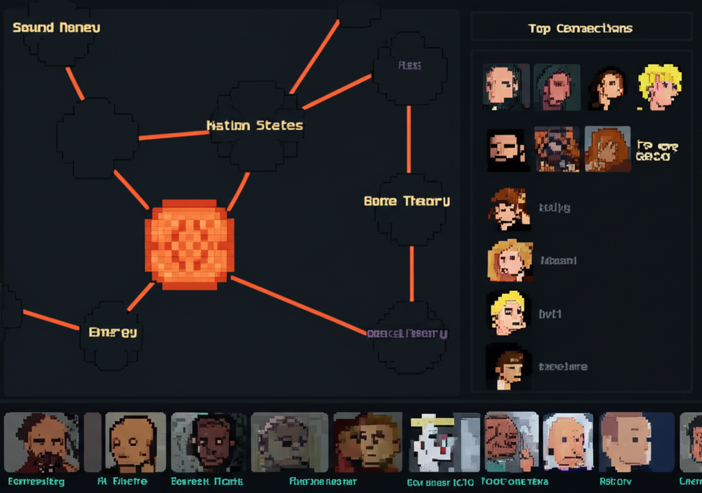

Speaker's belief network as pixel force graph. Central node with topic clusters radiating outward. Connected speakers sidebar. Every node tappable for exploration.

---

## 5. Speaker Tier System

Speakers earn their avatar tier based on contribution:

### 5a. Common (1-5 episodes, <10K words)
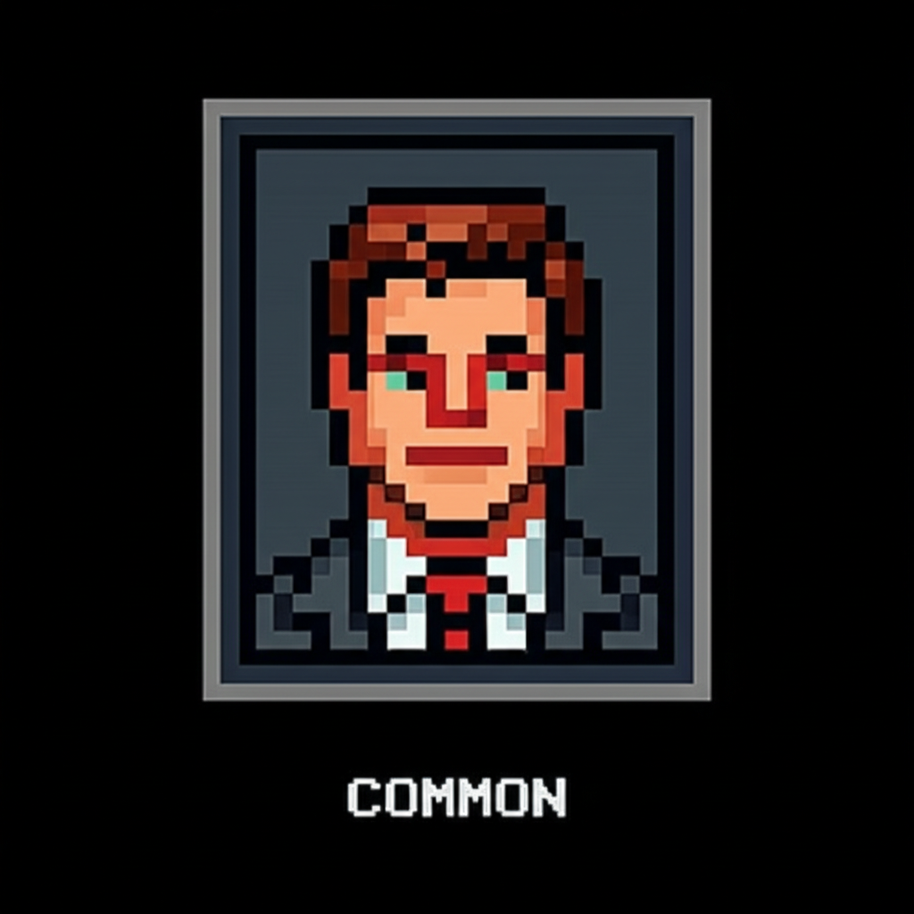

Simple 8-bit pixel portrait, gray border, minimal detail. Auto-generated. Cost: ~$0.

### 5b. Rare (6-20 episodes, 10K-50K words)
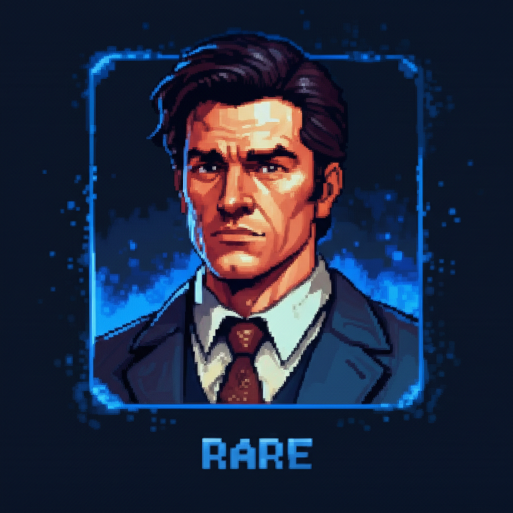

Detailed pixel art, blue glow border, personality shows through. Cost: ~$0.02.

### 5c. Epic (21-50 episodes, 50K-100K words)
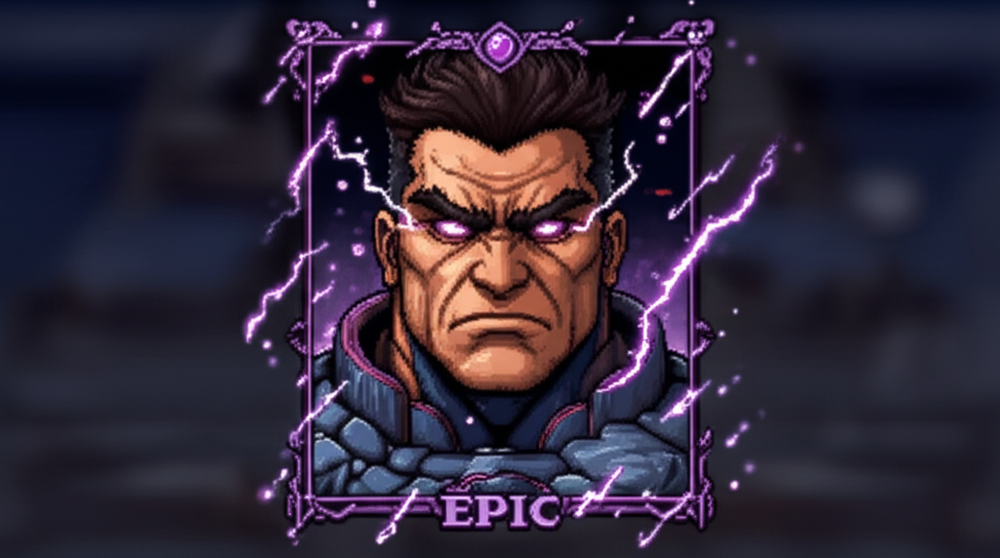

Full transformation — armor, purple energy, glowing eyes. Warrior status. Cost: ~$0.06.

### 5d. Legendary (50+ episodes OR 100K+ words)
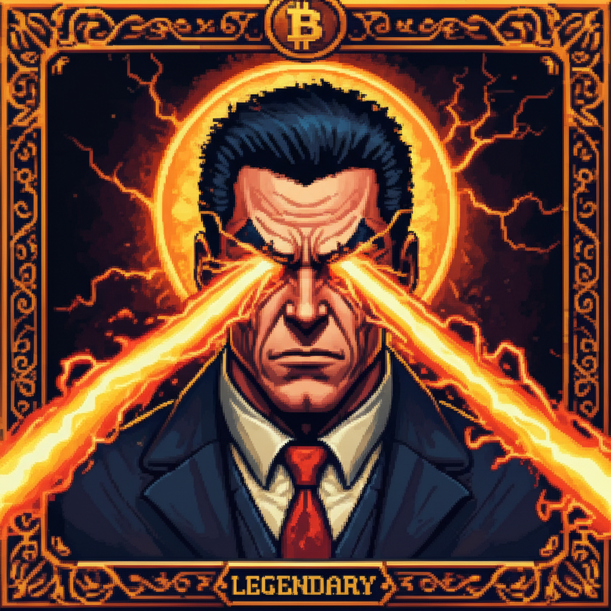

Final boss. Laser eyes, Bitcoin halo, golden ornate frame, lightning. Only ~10 speakers will reach this. Cost: ~$0.10.

### Tier Thresholds

| Tier | Episodes | Words Spoken | Border Color | Effects | Est. Count |
|------|----------|-------------|-------------|---------|-----------|
| 🟫 Common | 1-5 | <10K | Gray | None | ~120 |
| 🟦 Rare | 6-20 | 10K-50K | Blue glow | Particle sparkle | ~50 |
| 🟪 Epic | 21-50 | 50K-100K | Purple lightning | Energy crackling | ~20 |
| 🟧 Legendary | 50+ | 100K+ | Gold ornate | Laser eyes, fire, halo | ~10 |

**Total avatar generation cost: ~$3.20 for all ~200 speakers**

---

## 6. World Building

### 6a. Event Arena
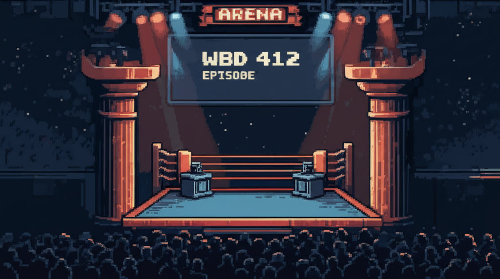

Events/Episodes aren't cards — they're **Arenas**. Pixel boxing ring or colosseum where beliefs are spoken. Enter an arena to see all beliefs from that event, who spoke, what clashed.

---

## 7. Entity Model

| Entity | UI Metaphor | Border | Description |
|--------|------------|--------|-------------|
| 🃏 Beliefs | Cards | Orange | Collectible, shareable, from podcast data (MINED) |
| 👤 People | Cards | Orange | RPG character sheets with stats + tier avatar |
| 🌐 Domains | Cards | Orange | Topic areas with belief clusters |
| 🃏 Community Beliefs | Cards | Teal | User-created, backed by research (CRAFTED) |
| ⚔️ Events/Episodes | Arenas | — | Where beliefs were spoken |
| 🏰 Organizations | Guilds | — | Teams, collective beliefs, faction alignment |

Cards come FROM arenas and are held BY guild members.

---

## 8. Avatar Generation Pipeline

### Process
1. Speaker data extracted from pipeline (name, episode count, total words)
2. Tier calculated from thresholds
3. AI image generation prompt constructed:
   - Includes speaker name + description for loose resemblance
   - Tier-specific style instructions (border, effects, complexity)
   - Consistent base prompt for pixel art style
4. Image generated via Gemini/Imagen API
5. Post-processed: resize to 256×256 + 64×64 thumbnail
6. Stored in MinIO (S3-compatible, already running)
7. Prompt + metadata saved to Supabase for regeneration

### Model Selection by Tier
| Tier | Model | Cost/Image |
|------|-------|-----------|
| Common | Gemini Flash (free) | $0.00 |
| Rare | Gemini Flash Image | $0.01-0.02 |
| Epic | Imagen 4.0 | $0.04-0.08 |
| Legendary | Imagen 4.0 Ultra | $0.08-0.12 |

### Open Question
Use reference photos for recognizability, or pure AI-imagined for safety? Reference = more recognizable but likeness rights risk. Pure AI = safer, more "game character" feel.

---

*Generated by Max Power ⚡ — Belief Engines*
