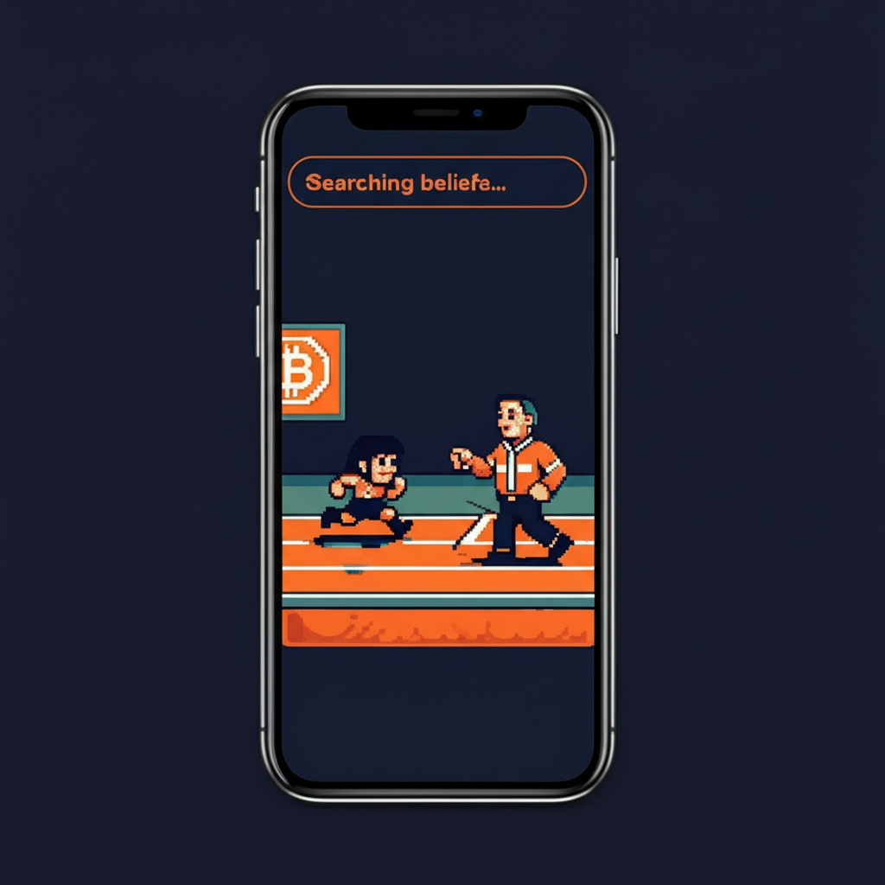
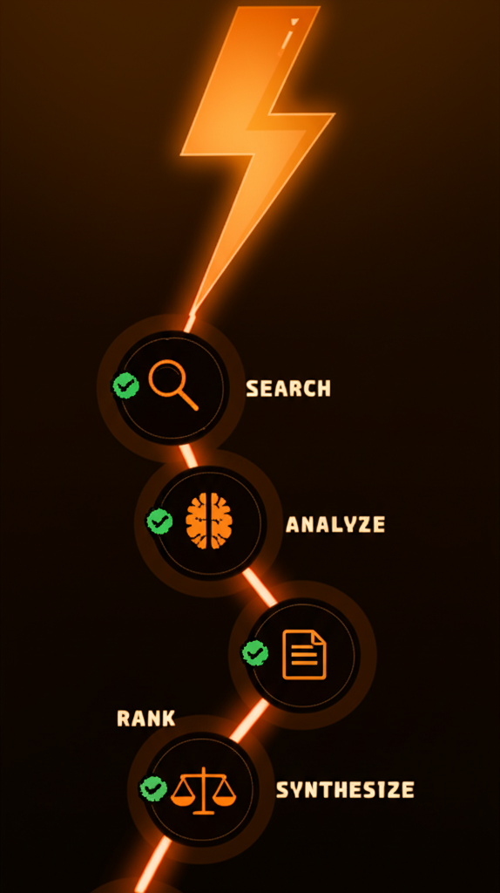
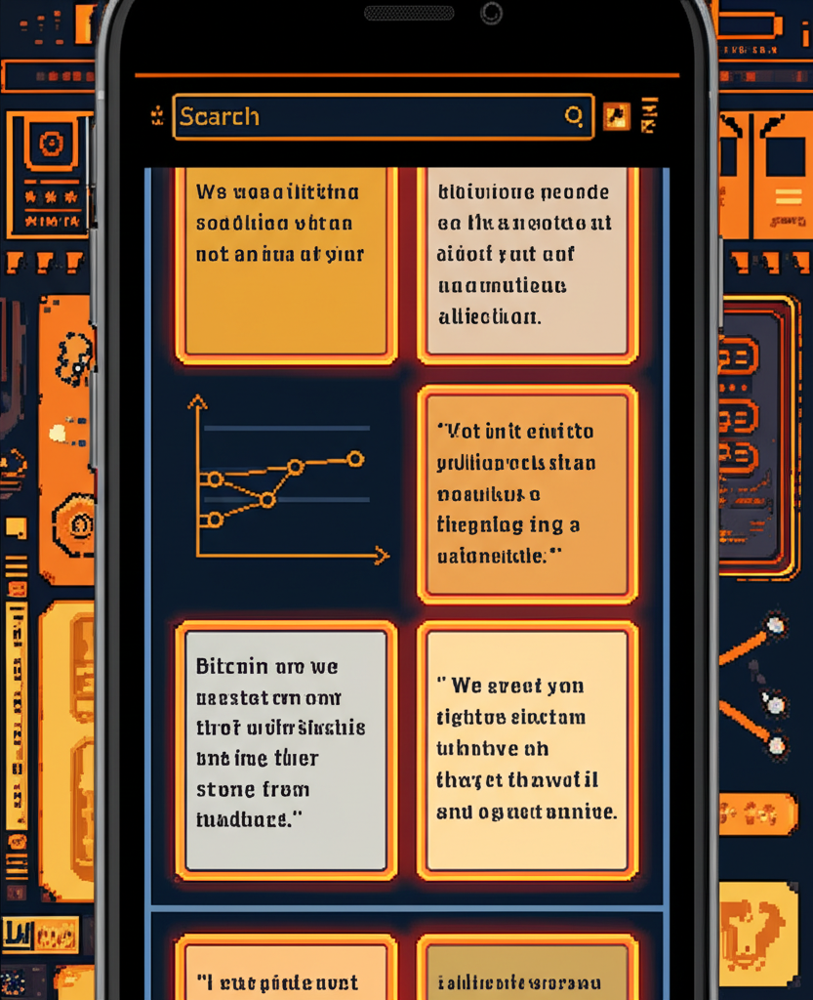
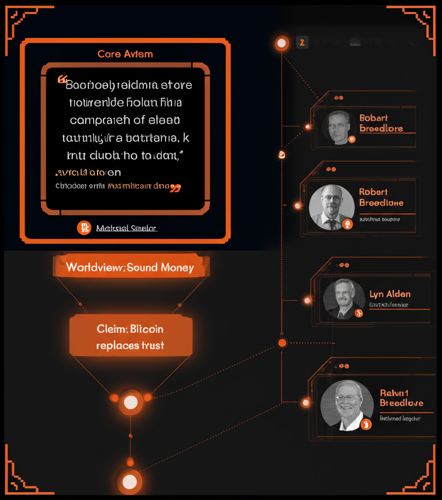
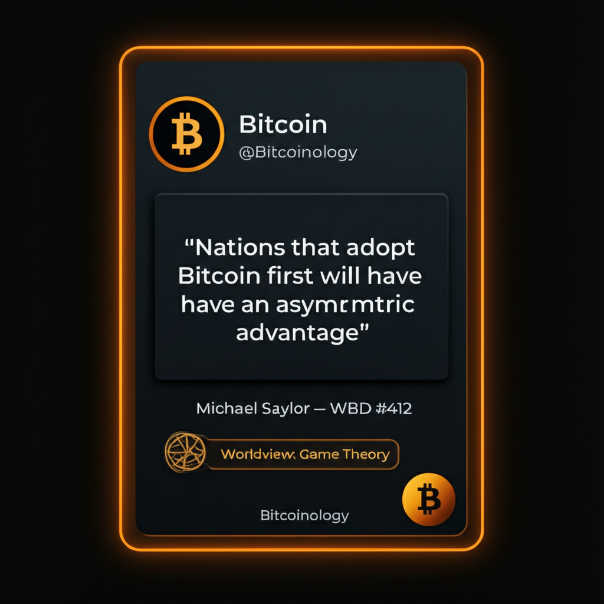
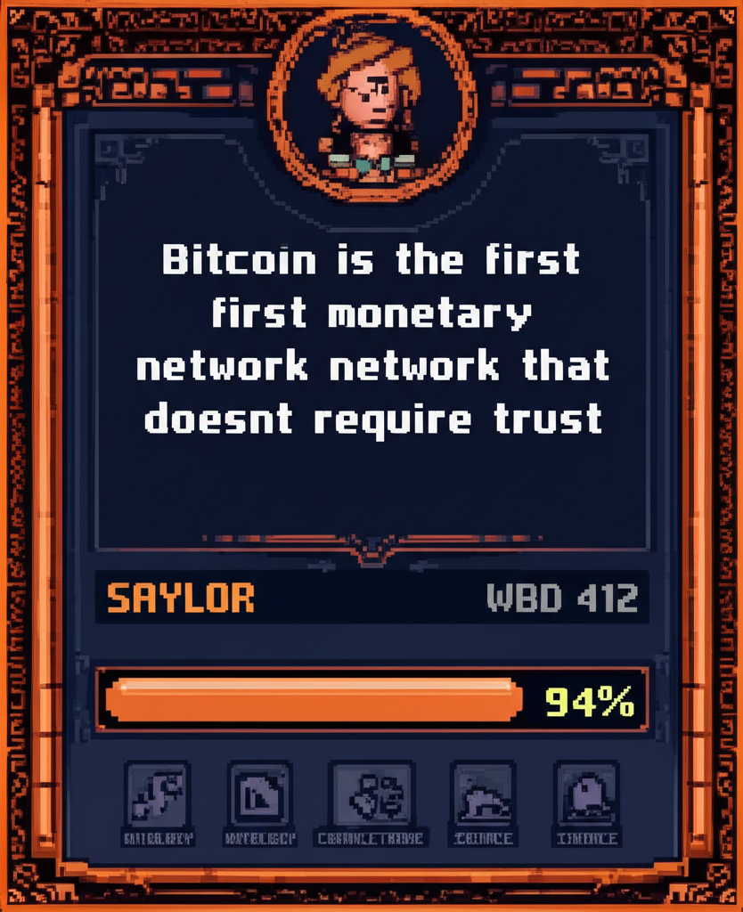
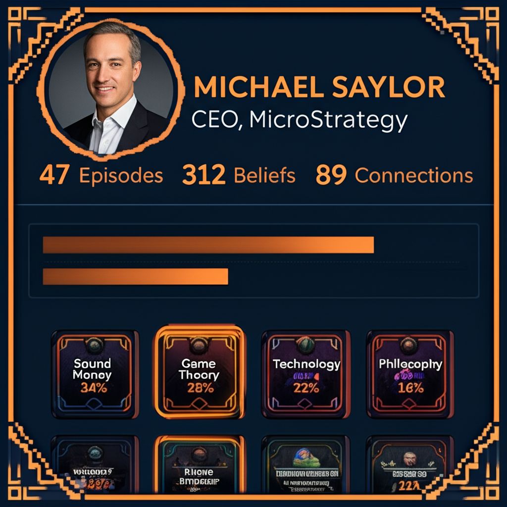
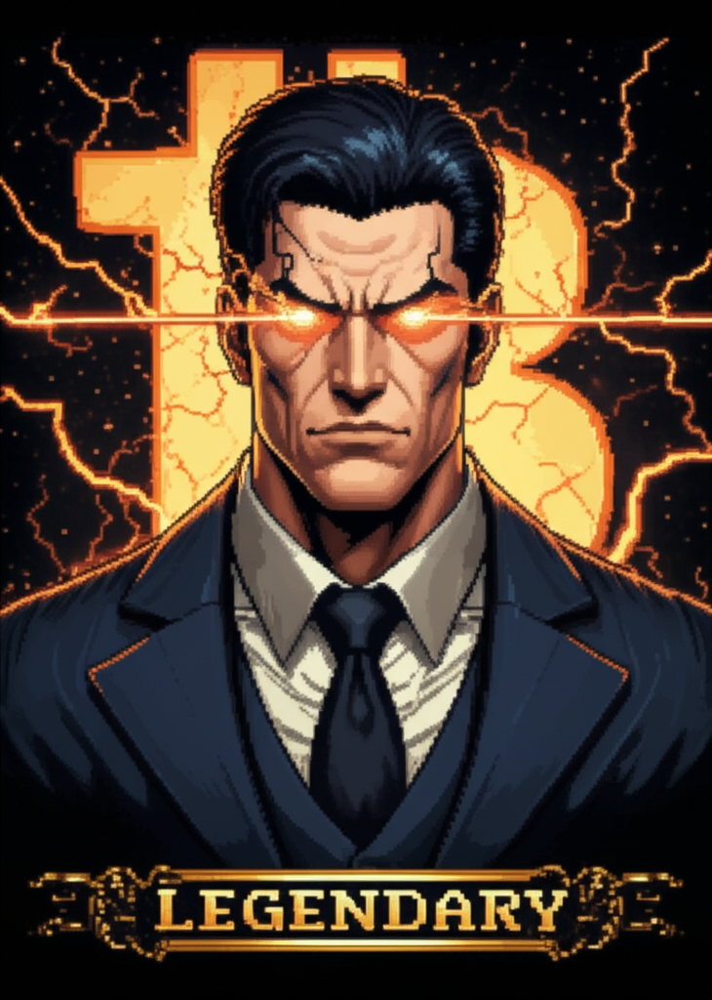

# Bitcoinology Design Deck
### v0.1 — February 12, 2026

---

## 🎮 Design Direction: Retro Arcade × Bitcoin Orange

The entire app feels like an NES/SNES game — pixelated UI, retro fonts, RPG mechanics, collectible cards. Not a corporate dashboard. A game you want to play.

**References:** Mike Tyson's Punch-Out, Double Dragon, Contra, Final Fantasy inventory screens, Chrono Trigger character portraits

**Color Palette:** Bitcoin orange (#F7931A), dark navy (#0A0E1A), electric white, teal/cyan (community elements)

---

## 1. Search Experience Flow

### 1a. Search Loading — "The Training Run"


User hits search → instead of a spinner, they get a retro 8-bit animated scene. Punch-Out training montage: pixel character running with a coach on an orange track, Bitcoin logo in background. "Searching beliefs..." in the search bar. Loops while agents do their work. Could rotate through different retro scenes (Contra run-and-gun, Double Dragon street walk) randomly each search.

### 1b. Search Complete — "The Strike"


Search completes → screen flashes → massive orange lightning bolt cracks down the screen. "BELIEFS FOUND" in arcade font. The bolt hits and splits into branches — each branch becomes a workflow node. 0.5 second flash animation, then holds and transitions into the workflow tree. The bolt IS the UI — not decoration, it's the actual data pipeline visualization.

### 1c. Active Pipeline — "The Workflow Tree"


The lightning bolt becomes a glowing orange pipeline running top to bottom. Each node = a real agent step: SEARCH 🔍 → ANALYZE 🧠 → RANK ⚖️ → SYNTHESIZE 📝. Green checkmarks light up as each completes. The bolt pulses with energy flowing downward. Users watch their answer being built in real-time. For Jackal deep research, the bolt branches into parallel threads.

### 1d. Results — "The Loot"


Lightning bolt fades, results appear. Belief cards in a grid with orange-bordered tiles — each card is a direct quote from a speaker. Small graph viz showing how beliefs connect. Pixel art borders and retro elements frame everything. Search bar stays at top. Feels like an RPG inventory screen — these are your collected beliefs, your loot from the search.

---

## 2. Card System

Three types of cards, each with different borders and mechanics:

### Card Type 1: Belief Cards (Orange Border)

#### Face — The Collectible


Speaker avatar, quote, speaker name + episode, confidence meter as retro health bar (94%). Bottom icons: Ontology, Connections, Source. Shareable on social media, collectible in your profile.

#### Expanded — The Portal


Tap to inspect. Left: original card + ontology tree (Core Axiom → Worldview → Claim). Right: connected speakers who share or challenge this belief (Breedlove, Lyn Alden) with mini-cards linked by connection lines. Every node is tappable — rabbit hole by design.

#### Social Embed — The Growth Loop


How it looks shared on Twitter/X. @Bitcoinology branding, quote, speaker + episode, ontology badge, logo. Every shared card is a growth vector — tap to land in the app on that exact belief.

### Card Type 2: Belief Cards — Full Pixel Art


Everything pixelated — avatar, text, border, confidence bar, action icons. SNES RPG inventory card aesthetic. This is the actual in-app collectible format.

### Card Type 3: Community Belief Cards (Teal Border)


Different color (teal/cyan) to distinguish from speaker-sourced beliefs. User avatar (basic pixel), their belief statement, research evidence as pixel items (scroll, microphone). Lightning bolt votes: agrees ⚡ / challenges ⚔️. Community cards are CRAFTED by users; speaker cards are MINED from podcast data.

---

## 3. Speaker Profiles

### Profile Card — Character Select


Like an RPG character select screen. Avatar with orange ring, name + title, stats (Episodes, Beliefs, Connections). Belief breakdown by category. Mini belief cards at bottom.

### Profile Expanded — Deep Inspection


Full view: belief network as force graph (speaker node centered, belief clusters radiating). Sidebar: top connections with other speakers + agreement scores. Every node tappable.

### Full Pixel RPG Character Sheet


The real deal. Legendary portrait with laser eyes, ornate pixel frame. Stats: Episodes 47, Beliefs 312, Connections 89, Words 847K. Skills with pixel bars. Belief card thumbnails at bottom. This IS a character select screen.

---

## 4. Speaker Tier System

### Rarity Tiers


Speakers earn their avatar based on contribution:

| Tier | Criteria | Visual |
|------|----------|--------|
| 🟫 **Common** | 1-5 episodes | Simple 8-bit pixel portrait, gray border |
| 🟦 **Rare** | 6-20 episodes | Detailed pixel art, blue glow effects |
| 🟪 **Epic** | 21-50 episodes | Full transformation, armor, purple energy, ornate border |
| 🟧 **Legendary** | 50+ episodes / 100K+ words | Laser eyes, lightning, boss-mode portrait, golden border |

Each speaker gets a unique AI-generated pixel avatar. Avatars evolve as more content gets processed — speakers literally "level up" in the game.

### Legendary Avatar Example


What 847K+ spoken words earns you. Laser eyes, Bitcoin symbol blazing, lightning crackling. Full pixel art boss portrait. Every legendary speaker gets a unique collectible identity.

---

## 5. Entity Types (Beyond Cards)

| Entity | UI Metaphor | Description |
|--------|-------------|-------------|
| 🃏 **Beliefs** | Cards (orange) | Collectible, shareable, inspectable |
| 👤 **People** | Cards (orange) | Character sheets with stats + tier |
| 🌐 **Domains** | Cards (orange) | Topic areas with belief clusters |
| ⚔️ **Events** | Arenas / Stages | Where beliefs were spoken — boxing rings, colosseum scenes |
| 🏰 **Organizations** | Guilds / Factions | Teams — browse members, collective beliefs, faction alignment |
| 🃏 **Community Beliefs** | Cards (teal) | User-created, backed by research, voted on |

Cards come FROM arenas and are held BY guild members. Everything connects.

---

## 6. Full User Flow

```
Open App
  → Matrix rain + retro title screen
  → Search bar prominently centered
  
Type Search
  → Retro training animation plays (Punch-Out jog)
  → Lightning STRIKES the screen
  → Bolt becomes the pipeline tree
  → Steps complete top to bottom (SEARCH → ANALYZE → RANK → SYNTHESIZE)
  → Flash
  → Belief cards land as results (your loot)

Tap a Belief Card
  → Card expands: ontology tree + connected speakers
  → Tap a speaker → their RPG character sheet
  → Tap a connection → another belief card
  → Infinite exploration

Share a Card
  → Beautiful social embed generates
  → Someone taps it → lands in the app on that belief
  → Growth loop

Community Participation
  → User creates their own belief card (teal border)
  → Attaches research (articles, clips, data)
  → Community votes: agrees ⚡ / challenges ⚔️
  → High-quality beliefs can merge into main graph
```

---

*Generated by Max Power ⚡ — Belief Engines*
