# PRD: Bitcoinology v2 — "The Matrix, But Orange"

**Author:** Max Power ⚡  
**Date:** 2026-02-11  
**Status:** Draft — awaiting Ryan's user story walkthrough  
**Repo:** [be-MaxPower](https://github.com/beliefengines/be-MaxPower)

---

## 1. Vision

A gamified, single-pane knowledge exploration tool that extracts what people **believe** from podcast conversations and makes those beliefs searchable, visual, and shareable.

Not a website. An **app** — alive, animated, community-driven.

> "The Matrix, but orange."

---

## 2. High-Level Architecture

```mermaid
graph TB
    subgraph "User Layer"
        UI[Bitcoinology App<br/>Next.js 14 / Vercel]
    end

    subgraph "API Layer"
        QR[/api/query<br/>Search + Route/]
        PB[/api/playbook<br/>Deep Analysis/]
        GR[/api/graph/data<br/>Speaker Graph/]
        TH[/api/threads<br/>Thread CRUD/]
        AU[/api/auth<br/>Login/Logout/]
    end

    subgraph "AI / Orchestration"
        MO[Motia<br/>Workflow Engine]
        CL[Claude<br/>Anthropic API]
        OA[OpenAI<br/>Embeddings]
        DS[DeepSeek<br/>Reasoning]
        TV[Tavily<br/>Web Search]
    end

    subgraph "Data Layer"
        SB[(Supabase<br/>Postgres + Auth)]
        QD[(Qdrant Cloud<br/>Vector Search)]
        HF[(HuggingFace<br/>Dataset)]
        PQ[Parquet CDN<br/>DuckDB-WASM]
    end

    subgraph "Pipeline (Offline)"
        DTD[be-flow-dtd<br/>Download→Transcribe→Diarize]
        ETL[be-podcast-etl<br/>10-Stage Belief Extraction]
    end

    UI --> QR & PB & GR & TH & AU
    QR --> MO --> CL & OA & DS & TV
    QR --> QD
    QR --> SB
    PB --> CL & QD & SB
    GR --> SB & PQ
    TH --> SB
    AU --> SB

    DTD -->|transcripts| SB
    ETL -->|beliefs + embeddings| SB & QD
    ETL -->|dataset export| HF

    style UI fill:#F7931A,stroke:#F7931A,color:#000
    style QD fill:#1a1a2e,stroke:#F7931A,color:#F7931A
    style SB fill:#1a1a2e,stroke:#3ECF8E,color:#3ECF8E
    style HF fill:#1a1a2e,stroke:#FFD21E,color:#FFD21E
    style CL fill:#1a1a2e,stroke:#D4A574,color:#D4A574
```



---

## 3. System Components

### 3.1 Frontend (be-bitcoinology-v1)
| Component | Purpose |
|-----------|---------|
| `AppShell` | Single-pane container — header, feature squares, content area, footer search |
| `FeatureSquares` | 3 tappable nav cards (Ontology, Analytics, Docs/Quotes/Data) |
| `Chat` | Streaming search results with AI responses |
| `SpeakerGraph` | Force-directed 2D graph (react-force-graph-2d) |
| `PlaybookCards` | 4-lens deep analysis (beliefs, timeline, sentiment, context) |
| `WorkflowTree` | *(Phase 2)* Animated pipeline visualization |

### 3.2 Pipeline (be-flow-dtd)
Download → Transcribe (Whisper large-v3) → Diarize (Pyannote 3.1) → Speaker ID (ECAPA-TDNN)
- Runs on **bare metal** 24/7
- Outputs structured JSON to Supabase
- GPU-optimized, Docker-ready

### 3.3 Pipeline (be-podcast-etl)
10-stage belief extraction:
1. Speaker resolution
2. Ad removal
3. Belief extraction
4. Worldview abstraction
5. Embedding generation (OpenAI 1536-dim)
6. Ideology weighting
7. Headlines
8. Matrix scoring
9. Clip extraction
10. Trust scores

---

## 4. API Reference

### 4.1 Internal APIs (Next.js Routes)

| Endpoint | Method | Auth | Description |
|----------|--------|------|-------------|
| `/api/query` | POST | ✅ | Main search — routes to direct search or playbook |
| `/api/playbook` | POST | ✅ | Deep 4-lens analysis of a topic |
| `/api/graph/data` | GET | ✅ | Speaker aggregations + similarity data for graph |
| `/api/threads` | GET/POST | ✅ | List/create search threads |
| `/api/threads/[id]` | GET | ✅ | Get thread by ID |
| `/api/auth/logout` | POST | ✅ | End session |
| `/api/invite/claim` | POST | ✅ | Claim beta invite code |

### 4.2 External Service APIs

| Service | API | Purpose | Auth Method |
|---------|-----|---------|-------------|
| **Qdrant Cloud** | REST / gRPC | Vector similarity search (1536-dim) | API key in header |
| **Supabase** | REST + Realtime | DB, Auth, Storage | Anon key (public) + Service role key (server) |
| **Anthropic (Claude)** | Messages API | Query routing, synthesis, playbook analysis | API key |
| **OpenAI** | Embeddings API | text-embedding-ada-002 for query embedding | API key |
| **DeepSeek** | Chat API | Optional reasoning model | API key |
| **Tavily** | Search API | Web search for Jackal agent | API key |
| **HuggingFace** | Datasets API | Dataset download/sync | HF token |
| **Motia** | Internal | Workflow orchestration (agentic pipeline) | Redis state |

### 4.3 AI Agents

| Agent | Model | Purpose | Feature Flag |
|-------|-------|---------|-------------|
| **Oracle** | Claude | Main search routing + synthesis | `ENABLE_ORACLE_AGENT` |
| **Jackal** | Claude + Tavily | Web-augmented research | `ENABLE_JACKAL_AGENT` |
| **Playbook** | Claude | Deep 4-lens belief analysis | `ENABLE_PLAYBOOK_AGENT` |

---

## 5. Environment Variables

```bash
# === REQUIRED ===
NEXT_PUBLIC_SUPABASE_URL=          # Supabase project URL
NEXT_PUBLIC_SUPABASE_ANON_KEY=     # Supabase anon/public key
SUPABASE_SERVICE_ROLE_KEY=         # Supabase service role (server only)
QDRANT_URL=                        # Qdrant Cloud cluster endpoint
QDRANT_API_KEY=                    # Qdrant API key
ANTHROPIC_API_KEY=                 # Claude API key
OPENAI_API_KEY=                    # OpenAI (embeddings)

# === AUTH ===
GOOGLE_CLIENT_ID=                  # Google OAuth
GOOGLE_CLIENT_SECRET=              # Google OAuth
NEXTAUTH_URL=                      # App URL (http://localhost:3000)
NEXTAUTH_SECRET=                   # Session encryption

# === OPTIONAL ===
DEEPSEEK_API_KEY=                  # DeepSeek reasoning model
TAVILY_API_KEY=                    # Web search for Jackal
HF_TOKEN=                          # HuggingFace dataset access
REDIS_URL=                         # Motia state persistence
PARQUET_CDN_URL=                   # DuckDB-WASM data files
OLLAMA_URL=                        # Local dev LLM

# === FEATURE FLAGS ===
ENABLE_ORACLE_AGENT=true
ENABLE_JACKAL_AGENT=true
ENABLE_PLAYBOOK_AGENT=true
BETA_MODE=true

# === OBSERVABILITY ===
SENTRY_DSN=                        # Error tracking
POSTHOG_KEY=                       # Analytics
RATE_LIMIT_RPM=60                  # Rate limiting
```

---

## 6. Data Model

### 6.1 Beliefs (HuggingFace Dataset: rchiera/bitcoinology)

**Size:** 1K-10K rows | **License:** CC BY-NC 4.0

| Field | Type | Description |
|-------|------|-------------|
| `id` | string | Unique belief ID (b_xxxxxxxx) |
| `podcast_slug` | string | Source podcast identifier |
| `episode_slug` | string | Source episode identifier |
| `speaker_slug` | string | Speaker identifier |
| `speaker_name` | string | Speaker display name |
| `timestamp_start` | float | Audio timestamp start (seconds) |
| `timestamp_end` | float | Audio timestamp end (seconds) |
| `quote_text` | string | Raw quote from transcript |
| `context_before` | string | ~100 tokens context before |
| `context_after` | string | ~100 tokens context after |
| `atomic_belief` | string | Core claim (≤25 words) |
| `topic` | string | Short topic label (2-5 words) |
| `polarity` | string | "for" / "against" / "neutral" |
| `polarity_confidence` | float | Confidence score (0-1) |
| `worldview` | string | Underlying principle |
| `core_axiom` | string | Foundational assumption |
| `tier` | int | Importance tier (1-5) |
| `polar_opposite` | string | Counter-argument |
| `tabloid_headline` | string | Sensational headline version |
| `weights` | list[float] | 10-dim positioning vector |
| `embedding` | list[float] | 1536-dim semantic vector |
| `created_at` | string | ISO timestamp |

#### 8-Layer Abstraction Hierarchy
```
Layer 0: Raw Quote + Context
Layer 1: Surface Statement (cleaned, ≤50 words)
Layer 2: Atomic Belief (core claim, ≤25 words)
Layer 3: Worldview (underlying principle)
Layer 4: Core Axiom (foundational assumption)
Layer 5: Polar Analysis (polar_opposite)
Layer 6: Tabloid Headline (sensational version)
Layer 7: Positioning Vector (10-dim weights)
```

#### 10-Dimensional Weights Vector
```
Dimensions 0-4 (domain affinity, 0.0-1.0):
  [0] Philosophical/spiritual
  [1] Moral/ethical
  [2] Political
  [3] Economic
  [4] Scientific/technical

Dimensions 5-9 (positioning, -1.0 to +1.0):
  [5] Academic ↔ Practical
  [6] Mainstream ↔ Contrarian
  [7] Institutional ↔ Individual
  [8] Epistemic certainty
  [9] Overton window position
```

### 6.2 Supabase Tables

| Table | Purpose |
|-------|---------|
| `threads` | Search sessions (id, user_id, title, updated_at) |
| `messages` | Chat messages within threads |
| `users` | User profiles (via Supabase Auth) |
| `invite_codes` | Beta access codes |
| *feedback* | *(New)* Thumbs up/down + notes per search |

### 6.3 Qdrant Collections

| Collection | Vector Dim | Purpose |
|------------|-----------|---------|
| `beliefs` | 1536 | Semantic search over atomic beliefs |

---

## 7. Screens & Mockups

### Screen 0: Login


**Description:** Dark, minimal login screen. Bitcoin globe logo centered. "Bitcoinology" in orange. Two auth options: Google OAuth and Magic Link. Beta invite code field.

**Key elements:**
- Bitcoin globe logo (existing component)
- Google OAuth button
- Magic link email input
- Beta invite code field
- Orange (#F7931A) accent throughout

---

### Screen 1: Home (Empty State)


**Description:** First thing a new user sees after login. Three feature squares at top, empty content area with call-to-action, search bar at bottom.

**Key elements:**
- Header: logo + avatar + menu
- 3 Feature Squares: 2D Ontology | Analytics | Docs Quotes Data
- Empty state: "Search what people actually believe"
- Footer: search bar with dashed orange border

---

### Screen 2: Home (With Threads)


**Description:** Returning user sees their previous search threads as tappable cards. Each card shows the search title, date, and mini preview squares.

**Key elements:**
- Thread cards with orange dashed borders
- Mini preview squares per thread (graph, chart, doc)
- Tap to resume a previous exploration
- Search bar still at bottom for new searches

---

### Screen 3: Search Active (Workflow Tree)


**Description:** When a search fires, the main content area shows an animated workflow tree. Each node represents a pipeline step, lighting up as it progresses.

**Key elements:**
- Tree nodes: Query → Route → Vector Search / Playbook → Synthesize → Response
- Node states: pending (gray) → active (orange glow) → complete (green)
- Animated connections between nodes
- Real-time status from Motia SSE events
- This IS the loading state (replaces spinner)

---

### Screen 4: Ontology Graph (Expanded)


**Description:** Tapping "2D Ontology" square expands to full graph view. Force-directed graph showing speakers as nodes, beliefs as connections.

**Key elements:**
- react-force-graph-2d visualization
- Nodes = speakers (size = number of beliefs)
- Edges = shared topics/beliefs
- Tap node to see speaker's beliefs
- Orange color scheme on black background
- Zoom/pan/pinch interactions

---

### Screen 5: Search Results


**Description:** After search completes, results show as belief cards with key themes at top.

**Key elements:**
- Key themes tags (orange pills)
- Belief cards: speaker name, atomic belief, polarity indicator, confidence
- Source podcast/episode reference
- Tap card for full context (quote + surrounding text)
- Thumbs up/down feedback buttons per card *(new)*

---

### Screen 6: Analytics (Expanded)
📸 *mockup pending*

**Description:** Tapping "Analytics" square shows charts and data visualizations.

---

### Screen 7: Docs/Quotes/Data (Expanded)
📸 *mockup pending*

**Description:** Tapping "Docs Quotes Data" square shows raw quotes, source documents, and data browser.

---

## 8. Search Flow


---

## 9. User Stories

*Skeleton — to be filled in during Ryan's walkthrough*

### US-1: First Visit / Onboarding
**As a** new user  
**I want to** understand what Bitcoinology does in 5 seconds  
**So that** I know whether to sign up  
**Acceptance Criteria:** TBD

### US-2: Search
**As a** logged-in user  
**I want to** search what people believe about a Bitcoin topic  
**So that** I can explore different perspectives  
**Acceptance Criteria:** TBD

### US-3: Explore Results
**As a** user who just searched  
**I want to** see beliefs organized by speaker, sentiment, and abstraction level  
**So that** I can understand the landscape of opinions  
**Acceptance Criteria:** TBD

### US-4: Knowledge Graph
**As a** user  
**I want to** see how beliefs connect in a visual graph  
**So that** I can discover relationships I didn't expect  
**Acceptance Criteria:** TBD

### US-5: Share
**As a** user who found something interesting  
**I want to** share my search as a public artifact  
**So that** other Bitcoiners can explore and build on it  
**Acceptance Criteria:** TBD

### US-6: Provide Feedback
**As a** user  
**I want to** rate search results (thumbs up/down + optional note)  
**So that** the system improves over time  
**Acceptance Criteria:** TBD

### US-7: Resume Exploration
**As a** returning user  
**I want to** see my previous searches and continue where I left off  
**So that** I can build on past explorations  
**Acceptance Criteria:** TBD

---

## 10. Deployment Architecture


---

## 11. Open Questions

1. What's the onboarding flow? Just Google OAuth, or tour/walkthrough?
2. How prominent should the workflow tree be? Full screen during search, or sidebar?
3. Do we want audio playback? (We have timestamps back to original podcast)
4. What's the monetization timeline for 10 sats/search?
5. How do community contributions work? Can users submit new podcast episodes?
6. What's the current Qdrant cluster URL and collection name?
7. How many podcasts/episodes are in the dataset currently?
8. Motia — cloud or self-hosted? What's the Redis setup?
9. What Supabase plan are we on? (affects PITR backup options)

---

## 12. Phased Delivery

| Phase | Scope | Status |
|-------|-------|--------|
| **Phase 1** | App shell + feature squares + search | PR #13 (in review) |
| **Phase 2** | Workflow tree visualization | Spec needed |
| **Phase 3** | Knowledge graph building (searches contribute) | Planned |
| **Phase 4** | Sharing + gamification + Lightning (10 sats) | Future |

---

*This is a living document. Updated as Ryan walks through user stories and we iterate on design.*
