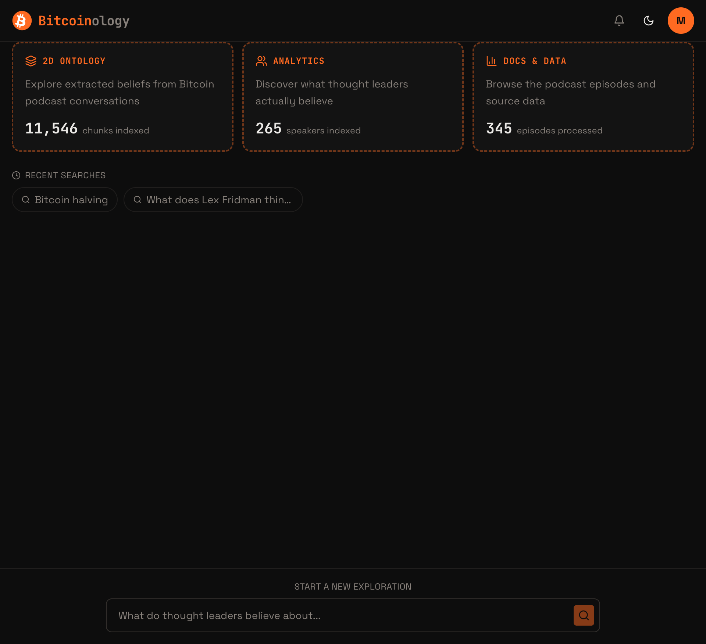
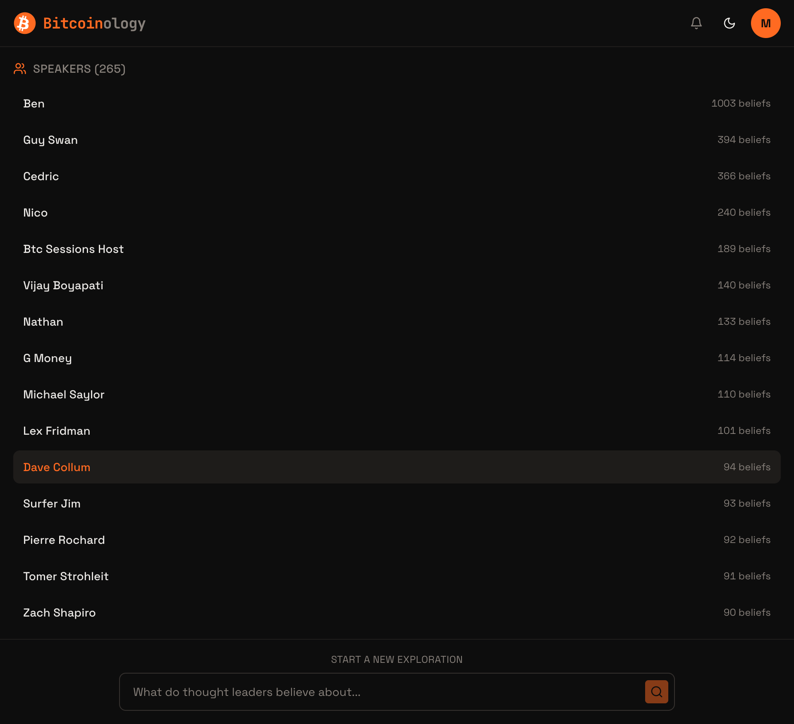
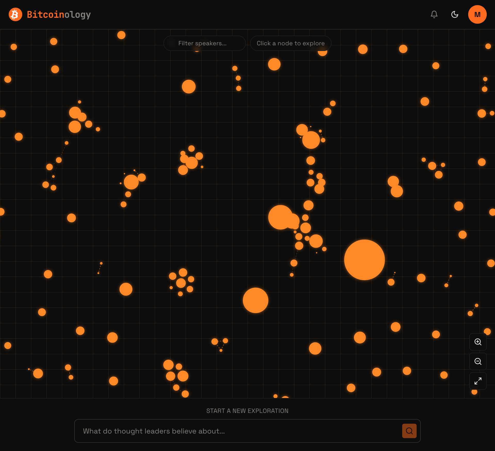
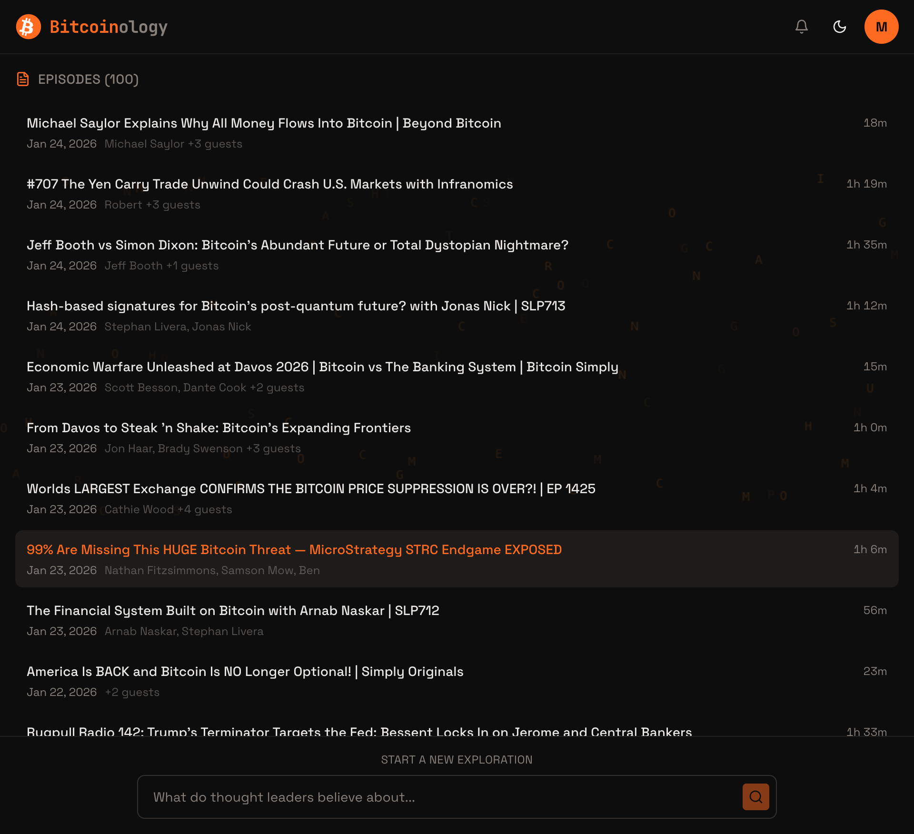
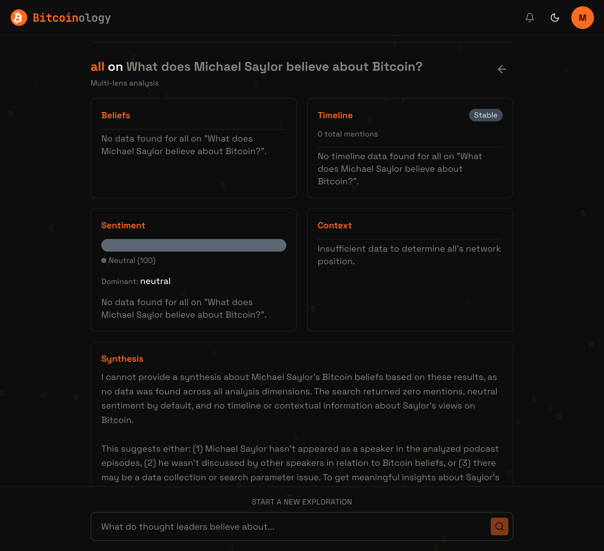
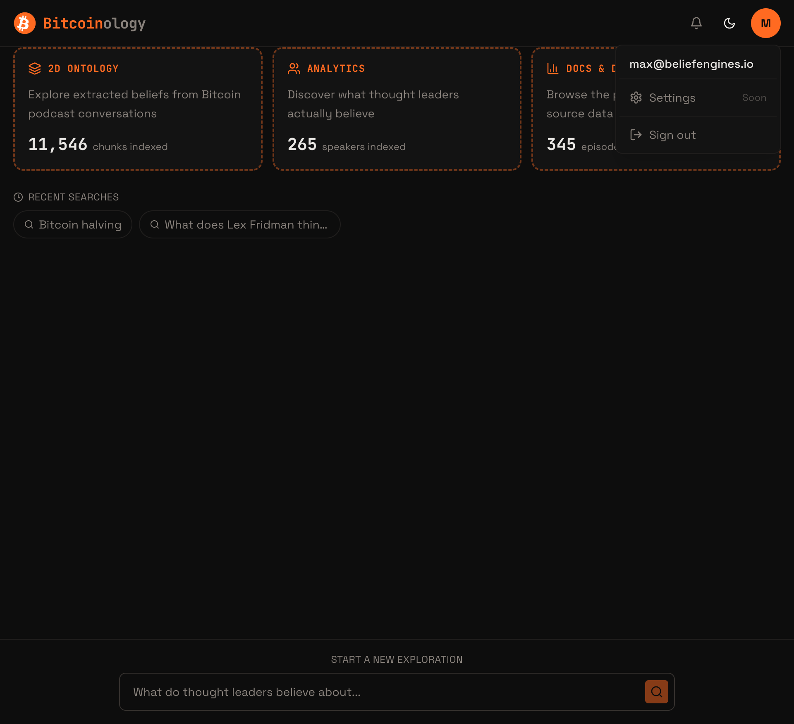
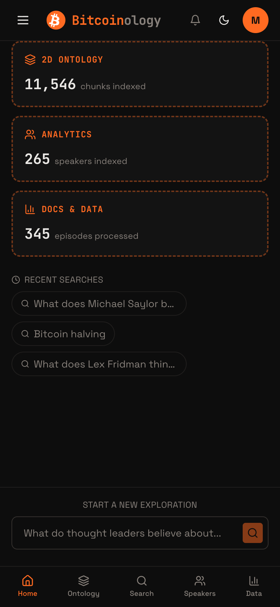
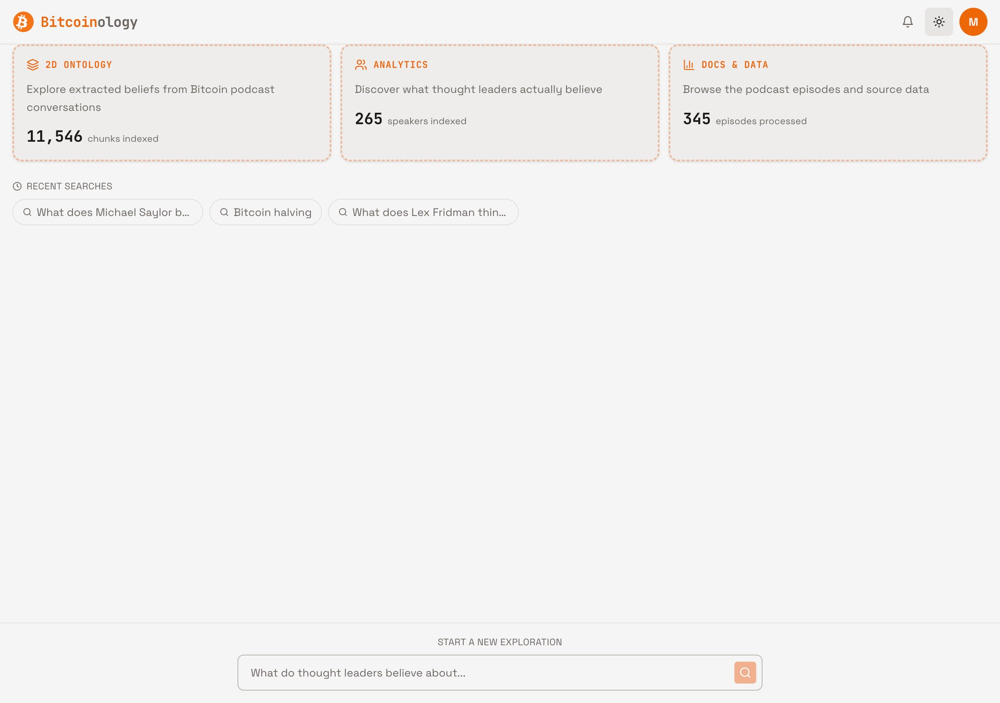

# 🔍 Visual QA Gap Analysis — PRD vs Live Site

**Date:** 2026-02-14 | **Analyst:** Max Power ⚡ | **Site:** https://bitcoinology.beliefengines.io  
**PRD Source:** `_bmad-output/planning-artifacts/prd.md` + design mockups  
**Screenshots:** `docs/qa-screenshots/`

---

## Table of Contents

- [Executive Summary](#executive-summary)
- [1. Home Screen](#1-home-screen)
- [2. Search — Empty State](#2-search--empty-state)
- [3. Search — Results & Belief Cards](#3-search--results--belief-cards)
- [4. Speakers Panel (Analytics)](#4-speakers-panel-analytics)
- [5. Ontology / Graph Panel](#5-ontology--graph-panel)
- [6. Docs & Data Panel](#6-docs--data-panel)
- [7. Playbook / Deep Analysis](#7-playbook--deep-analysis)
- [8. Header, Nav & Dropdowns](#8-header-nav--dropdowns)
- [9. Mobile Viewport (390×844)](#9-mobile-viewport-390844)
- [10. Light Mode](#10-light-mode)
- [11. Cross-Cutting Issues](#11-cross-cutting-issues)
- [12. Previously Flagged Gaps — Now Resolved](#12-previously-flagged-gaps--now-resolved)
- [13. Priority Summary Table](#13-priority-summary-table)
- [14. Recommendations](#14-recommendations)

---

## Executive Summary

**Overall Progress: ~75% of M1-M4 PRD vision shipped** (up from ~55% in previous analysis).

Since the Feb 13 gap analysis, **significant improvements** have landed:
- ✅ Speakers panel now works (was P0 broken)
- ✅ Recent searches persist and display on home
- ✅ Search results show individual belief cards with timestamps and match scores
- ✅ Hamburger menu implemented on mobile with Threads, Settings, Sign Out
- ✅ Mobile bottom navigation bar (Home, Ontology, Search, Speakers, Data)
- ✅ Feature squares have dashed orange borders per mockup
- ✅ "Start a new exploration" label present
- ✅ Graph has filter input, zoom controls, and hint banner
- ✅ Notification bell icon in header
- ✅ Light/dark theme toggle

**Remaining critical gaps:**
1. **Ontology graph canvas bleeds through** all other panels (z-index bug) — P0
2. **Playbook returns empty data** despite search having results — P0
3. **Belief cards are raw transcript blocks**, not structured cards per PRD — P1
4. **No Key Themes synthesis** above individual beliefs — P1
5. **Settings page is stub** — P2
6. **No threads list panel** (menu item exists) — P1

---

## 1. Home Screen

**Screenshot:** `qa-screenshots/01-home-desktop.png`

| Element | PRD/Mockup | Live | Status |
|---------|-----------|------|--------|
| 3 feature squares with dashed orange borders | ✅ | ✅ Dashed orange borders, icons, stats | ✅ Done |
| "2D Ontology" / "Analytics" / "Docs & Data" labels | ✅ | ✅ Correct labels | ✅ Done |
| Stats (chunks, speakers, episodes) | ✅ | ✅ 11,546 / 265 / 345 | ✅ Done |
| Recent search history cards | ✅ Cards with mini-thumbnails | ⚠️ Chips/pills (not cards with thumbnails) | ⚠️ P2 |
| "Start a new exploration" label | ✅ | ✅ Present above search bar | ✅ Done |
| Search bar sticky at bottom | ✅ | ✅ Sticky footer | ✅ Done |
| Previous search cards with 🕸️📊📄 thumbnails | ✅ Per mockup | ❌ Shows as text chips only | ⚠️ P2 |

**Gaps:**
- **G-01** ⚠️ P2: Recent searches show as text chips, not the rich cards with mini Ontology/Analytics/Docs thumbnails per mockup (`bitcoinology-logged-in.html`). Current implementation is functional but visually simpler.

---

## 2. Search — Empty State

The search bar on home IS the empty state. Typing and submitting transitions to the search panel. The flow works correctly.

| Element | Status |
|---------|--------|
| Search input placeholder text | ✅ "What do thought leaders believe about..." |
| Submit button (disabled when empty) | ✅ Correctly disabled |
| Search history chips clickable | ✅ Clicking re-runs search |

**No gaps in empty state.**

---

## 3. Search — Results & Belief Cards

**Screenshots:** `qa-screenshots/06-search-results-bottom.png`, `qa-screenshots/07-search-results-streaming.png`, `qa-screenshots/08-search-results-with-actions.png`

| Element | PRD/Mockup | Live | Status |
|---------|-----------|------|--------|
| Key Themes synthesis at top | ✅ Numbered themes with quotes | ❌ Missing — jumps straight to belief cards | 🚫 P1 |
| Individual belief cards | ✅ Structured: speaker, quote, episode, timestamp, score | ⚠️ Shows raw transcript blocks with speaker tag, timestamp, match % | ⚠️ P1 |
| Speaker name on each card | ✅ | ✅ "michael saylor" button on each card | ✅ Done |
| Timestamp badge | ✅ Episode @ timestamp | ✅ Clock icon + timestamp (e.g., "37:32") | ✅ Done |
| Match score | Not in original PRD | ✅ "35% match" badge — nice addition | ✅ Bonus |
| Per-belief "Deep Analysis" button | ✅ | ✅ Each card has its own Deep Analysis button | ✅ Done |
| "Save to Thread" button | ✅ | ✅ Present below results | ✅ Done |
| "Share" button | ✅ | ✅ Present below results | ✅ Done |
| "Deep Analysis" global CTA | ✅ | ✅ Orange-highlighted button below results | ✅ Done |
| Belief count ("23 beliefs found") | ✅ | ❌ No count shown | 🚫 P2 |
| Feature squares visible during search | ✅ | ❌ Squares disappear when viewing results | ⚠️ P2 |
| Episode title in citations | ✅ Episode name + timestamp | ❌ Only timestamp, no episode name | ⚠️ P1 |

**Gaps:**
- **G-02** 🚫 P1: No Key Themes synthesis card above individual beliefs. PRD mockup shows numbered themes with grouped quotes before individual cards.
- **G-03** ⚠️ P1: Belief cards render as raw transcript blocks (long paragraphs of unstructured transcript text). PRD shows concise, structured cards with: speaker avatar, key quote, episode title, timestamp link, relevance score. Current cards dump entire transcript chunks.
- **G-04** ⚠️ P1: No episode title in citations — only timestamp shown. Should be "Episode: bitcoin-magazine-podcast @ 37:32".
- **G-05** 🚫 P2: No belief count header (e.g., "20 beliefs found").
- **G-06** ⚠️ P2: Feature squares not visible during search results view.

---

## 4. Speakers Panel (Analytics)

**Screenshot:** `qa-screenshots/03-analytics-speakers-desktop.png`

| Element | PRD | Live | Status |
|---------|-----|------|--------|
| Speaker list with names | ✅ | ✅ 265 speakers listed | ✅ Done |
| Belief count per speaker | ✅ | ✅ "1003 beliefs", "394 beliefs", etc. | ✅ Done |
| Clickable speaker rows | ✅ → triggers search | ⚠️ Dave Collum highlighted (orange) suggesting hover/active state | ✅ Done |
| Proper display names | ✅ | ⚠️ Some incomplete: "Ben", "Cedric", "Nico", "Nathan" (no last names) | ⚠️ P2 |
| Episode counts | ✅ | ❌ Only belief counts shown, no episode count | ⚠️ P3 |
| Speaker avatar/icon | Not in PRD | ❌ No avatars | — |

**Gaps:**
- **G-07** ⚠️ P2: Several speaker names are incomplete (first name only): "Ben", "Cedric", "Nico", "Nathan", "Surfer Jim". Should show full names where available.
- **G-08** ⚠️ P3: No episode count per speaker, only belief count.

---

## 5. Ontology / Graph Panel

**Screenshot:** `qa-screenshots/02-ontology-desktop.png`

| Element | PRD/Mockup | Live | Status |
|---------|-----------|------|--------|
| Force-directed speaker network | ✅ | ✅ Orange glowing nodes with connections | ✅ Done |
| Orange glow on nodes | ✅ | ✅ Glow effects visible | ✅ Done |
| Matrix-style grid background | ✅ | ✅ Grid with faint letter overlays | ✅ Done |
| Zoom controls (+, -, Reset) | ✅ | ✅ Three buttons bottom-right | ✅ Done |
| Filter input | ✅ "Filter: [All v]" | ✅ "Filter speakers..." text input | ✅ Done |
| Hint banner | ✅ "Click entities for info" | ✅ "Click a node to explore" | ✅ Done |
| Node click → speaker detail panel | ✅ Shows beliefs, connections | ⚠️ Clicking node triggers search directly (bypasses detail panel) | ⚠️ P1 |
| Dashed connection lines | ✅ | ✅ Visible dashed lines | ✅ Done |
| Node labels (speaker names) | ✅ Full names | ⚠️ Single letters visible on some nodes | ⚠️ P2 |

**Gaps:**
- **G-09** ⚠️ P1: Clicking a graph node bypasses the SpeakerPanel detail view and goes straight to search. PRD flow is: tap node → see speaker detail (beliefs count, connections, themes) → optionally "View All Beliefs".
- **G-10** ⚠️ P2: Node labels appear as single letters instead of full speaker names. Hard to identify speakers without hovering.

---

## 6. Docs & Data Panel

**Screenshot:** `qa-screenshots/04-docs-desktop.png`

| Element | PRD | Live | Status |
|---------|-----|------|--------|
| Episode list with titles | ✅ | ✅ Full episode titles | ✅ Done |
| Date per episode | ✅ | ✅ "Jan 24, 2026", etc. | ✅ Done |
| Speaker names per episode | ✅ | ✅ "Michael Saylor +3 guests", etc. | ✅ Done |
| Duration | Not specified | ✅ "18m", "1h 19m", etc. — nice addition | ✅ Bonus |
| Episode count header | ✅ | ✅ "EPISODES (100)" | ✅ Done |
| Clickable → episode detail | ✅ | ⚠️ Rows appear clickable (hover state) but unclear what opens | ⚠️ P2 |
| Proper speaker names (not slugs) | ✅ | ✅ Display names shown | ✅ Done |

**Gaps:**
- **G-11** ⚠️ P2: Only 100 episodes shown out of 345 processed. Need pagination or infinite scroll.
- **G-12** ⚠️ P2: No episode detail view when clicking a row.

---

## 7. Playbook / Deep Analysis

**Screenshot:** `qa-screenshots/09-playbook-deep-analysis.png`

| Element | PRD | Live | Status |
|---------|-----|------|--------|
| 4-lens grid (Beliefs, Timeline, Sentiment, Context) | ✅ 2×2 grid | ✅ Correct 2×2 layout with orange headers | ✅ Done |
| Beliefs lens | ✅ | ❌ "No data found" — empty | ❌ P0 |
| Timeline lens with "Stable" badge | ✅ | ⚠️ Shows "Stable" badge + "0 total mentions" | ❌ P0 |
| Sentiment lens with bars | ✅ Bullish/Neutral/Bearish | ⚠️ Shows bar but "Neutral (100)" — no real data | ❌ P0 |
| Context lens with related speakers | ✅ | ❌ "Insufficient data" | ❌ P0 |
| Synthesis section | ✅ Streaming paragraph | ⚠️ Shows text but says "no data was found" | ❌ P0 |
| Back arrow (←) | ✅ | ✅ Back arrow button top-right | ✅ Done |
| Query title displayed | ✅ | ✅ "all on What does Michael Saylor believe about Bitcoin?" | ✅ Done |
| "Multi-lens analysis" subtitle | Not specified | ✅ Present | ✅ Bonus |

**Gaps:**
- **G-13** ❌ P0: **Playbook returns no data across all 4 lenses** despite the same query returning 20+ belief cards in search. The playbook API is not receiving or passing the search context/results to the analysis pipeline. This is the most critical functional bug — the entire Deep Analysis feature is non-functional.

**Root Cause Hypothesis:** The playbook route likely searches for speaker="all" with the full query string instead of using the search results/chunks that were already retrieved. The search found results via `searchBeliefs` + `semanticSearch` tools, but the playbook may be doing its own separate search that fails.

---

## 8. Header, Nav & Dropdowns

**Screenshots:** `qa-screenshots/05-user-menu-dropdown.png`, `qa-screenshots/11-mobile-hamburger-menu.png`

| Element | PRD/Mockup | Live | Status |
|---------|-----------|------|--------|
| Logo + "Bitcoinology" brand | ✅ | ✅ Bitcoin globe logo + text | ✅ Done |
| Notification bell icon | ✅ | ✅ Present in header | ✅ Done |
| Theme toggle (sun/moon) | Not in PRD | ✅ Working | ✅ Bonus |
| User avatar with initial | ✅ Orange circle | ✅ "M" in orange circle | ✅ Done |
| User menu dropdown | ✅ | ✅ Shows email, Settings (Soon), Sign out | ✅ Done |
| Hamburger menu (mobile) | ✅ | ✅ Shows Home, Threads, Settings, Sign Out | ✅ Done |
| Hamburger menu (desktop) | ✅ | ❌ No hamburger on desktop | ⚠️ P3 |
| Notifications dropdown content | ✅ List of notifications | ❌ Bell exists but no dropdown content | 🚫 P3 |
| Settings page | ✅ | ❌ Stub ("Soon" label) | 🚫 P3 |

**Gaps:**
- **G-14** 🚫 P3: Notification bell has no dropdown/content.
- **G-15** 🚫 P3: Settings page is a stub.

---

## 9. Mobile Viewport (390×844)

**Screenshots:** `qa-screenshots/10-mobile-home.png`, `qa-screenshots/11-mobile-hamburger-menu.png`, `qa-screenshots/12-mobile-ontology.png`

| Element | PRD | Live | Status |
|---------|-----|------|--------|
| Feature squares stacked vertically | ✅ | ✅ Single column, full width | ✅ Done |
| Bottom navigation bar | ✅ | ✅ Home, Ontology, Search, Speakers, Data | ✅ Done |
| Hamburger menu (≡) | ✅ | ✅ With Home, Threads, Settings, Sign Out | ✅ Done |
| Search bar accessible | ✅ | ✅ Sticky at bottom above nav bar | ✅ Done |
| Graph responsive on mobile | ✅ | ✅ Full-width graph with zoom controls | ✅ Done |
| Active state on bottom nav | ✅ | ✅ "Ontology" highlighted when active | ✅ Done |

**Mobile is well-implemented.** No critical gaps. Minor polish items:
- **G-16** ⚠️ P3: Feature squares on mobile lose the description text shown on desktop (only show title + stat). This is acceptable responsive behavior but worth noting.

---

## 10. Light Mode

**Screenshot:** `qa-screenshots/13-light-mode-home.jpg`

| Element | Status |
|---------|--------|
| Theme toggle works | ✅ |
| Feature squares readable | ✅ Light bg with orange text |
| Text contrast adequate | ✅ |
| Search bar visible | ✅ |
| Overall light theme coherent | ✅ |

**No significant gaps in light mode.** It's clean and well-themed.

---

## 11. Cross-Cutting Issues

### **G-17** ❌ P0: Ontology Graph Canvas Bleeds Through All Panels

**Visible in:** `qa-screenshots/04-docs-desktop.png`, `qa-screenshots/06-search-results-bottom.png`, `qa-screenshots/07-search-results-streaming.png`, `qa-screenshots/08-search-results-with-actions.png`, `qa-screenshots/09-playbook-deep-analysis.png`

The force-graph canvas with floating letter labels (A, B, C, D, E, etc.) is visible BEHIND the Docs, Search Results, and Playbook panels. This is a **z-index / visibility bug** — the graph canvas is not being hidden or covered when other panels are active. The letters appear as semi-transparent overlays throughout the page.

**Fix:** Set `display: none` or `visibility: hidden` on the graph canvas container when `panel !== 'ontology'`, or ensure the active panel has a solid background with proper z-index stacking.

### **G-18** ⚠️ P2: No Active State on Feature Squares

When viewing Ontology/Analytics/Docs, the corresponding feature square should show an active state (solid bg fill per mockup). Currently no visual indicator of which panel is active (on desktop — mobile bottom nav does have active state).

---

## 12. Previously Flagged Gaps — Now Resolved ✅

These items from the Feb 13 gap analyses are **now fixed**:

| Previous Gap | Status |
|-------------|--------|
| Speakers panel empty (P0) | ✅ **Fixed** — shows 265 speakers with belief counts |
| Search results don't persist on panel switch (P0) | ✅ **Fixed** — recent searches persist |
| No hamburger menu / mobile nav (P1) | ✅ **Fixed** — hamburger + bottom nav bar |
| No "Start a new exploration" label (P3) | ✅ **Fixed** — present above search |
| Graph zoom controls not wired (P1) | ✅ **Fixed** — +/−/reset buttons work |
| Graph filter missing (P2) | ✅ **Fixed** — "Filter speakers..." input |
| Graph hint banner missing (P3) | ✅ **Fixed** — "Click a node to explore" |
| Feature squares dashed orange borders (P2) | ✅ **Fixed** — dashed borders per mockup |
| No user menu dropdown (P2) | ✅ **Fixed** — email + Settings + Sign Out |
| No search history (P2) | ✅ **Fixed** — Recent Searches chips on home |
| Speaker name slugs (P1) | ✅ **Fixed** — display names shown |
| No Deep Analysis button (P1) | ✅ **Fixed** — button exists + triggers playbook |
| Notification bell missing | ✅ **Fixed** — bell icon in header |

**13 previously flagged gaps resolved.** Strong sprint progress.

---

## 13. Priority Summary Table

| ID | Gap | Priority | Effort | Section |
|----|-----|----------|--------|---------|
| **G-13** | Playbook returns no data across all 4 lenses | **P0** | M | [Playbook](#7-playbook--deep-analysis) |
| **G-17** | Ontology graph canvas bleeds through all panels (z-index) | **P0** | S | [Cross-Cutting](#11-cross-cutting-issues) |
| **G-02** | No Key Themes synthesis card above individual beliefs | **P1** | M | [Search](#3-search--results--belief-cards) |
| **G-03** | Belief cards show raw transcript, not structured cards | **P1** | M | [Search](#3-search--results--belief-cards) |
| **G-04** | No episode title in citations (only timestamp) | **P1** | S | [Search](#3-search--results--belief-cards) |
| **G-09** | Graph node click bypasses SpeakerPanel detail view | **P1** | M | [Ontology](#5-ontology--graph-panel) |
| **G-01** | Recent searches as chips, not rich cards with thumbnails | **P2** | M | [Home](#1-home-screen) |
| **G-05** | No belief count header above results | **P2** | S | [Search](#3-search--results--belief-cards) |
| **G-06** | Feature squares hidden during search | **P2** | S | [Search](#3-search--results--belief-cards) |
| **G-07** | Incomplete speaker names (first name only) | **P2** | S | [Speakers](#4-speakers-panel-analytics) |
| **G-10** | Graph nodes show single letters, not full names | **P2** | S | [Ontology](#5-ontology--graph-panel) |
| **G-11** | Only 100 episodes shown (345 available) | **P2** | S | [Docs](#6-docs--data-panel) |
| **G-12** | No episode detail view | **P2** | M | [Docs](#6-docs--data-panel) |
| **G-18** | No active state on desktop feature squares | **P2** | S | [Cross-Cutting](#11-cross-cutting-issues) |
| **G-08** | No episode count per speaker | **P3** | S | [Speakers](#4-speakers-panel-analytics) |
| **G-14** | Notification bell has no dropdown | **P3** | M | [Header](#8-header-nav--dropdowns) |
| **G-15** | Settings page is stub | **P3** | L | [Header](#8-header-nav--dropdowns) |
| **G-16** | Mobile feature squares lose descriptions | **P3** | S | [Mobile](#9-mobile-viewport-390844) |

### By Priority
- **P0 (2 items):** G-13 (playbook empty), G-17 (graph z-index bleed) — **Must fix immediately**
- **P1 (4 items):** G-02, G-03, G-04, G-09 — Core search UX & graph interaction
- **P2 (7 items):** G-01, G-05, G-06, G-07, G-10, G-11, G-12, G-18 — Visual polish
- **P3 (4 items):** G-08, G-14, G-15, G-16 — Nice-to-haves

---

## 14. Recommendations

### Immediate (Before Demo)
1. **Fix G-17 (graph bleed)** — Simple CSS fix. Set `display: none` on graph container when not active. **30 min fix.**
2. **Fix G-13 (playbook empty)** — Debug the playbook API route to ensure it receives search context/chunks. Likely the playbook is running its own query instead of using cached results. **2-4 hour fix.**

### Next Sprint
3. **G-03 + G-02** — Restructure search results to show a Key Themes synthesis card at top, then individual belief cards with truncated quotes (not full transcript dumps). Parse speaker, episode title, timestamp into discrete fields.
4. **G-04** — Include episode title in citation badges alongside timestamp.
5. **G-09** — Wire SpeakerPanel as intermediate view on graph node click.

### Polish Sprint
6. Address P2 items: active states, belief counts, episode pagination, speaker name completeness.
7. Address P3 items: notification dropdown, settings page, episode detail view.

---

*Report generated 2026-02-14 00:45 PST by Max Power ⚡*  
*Screenshots: 13 captured across all panels, states, and viewports*
